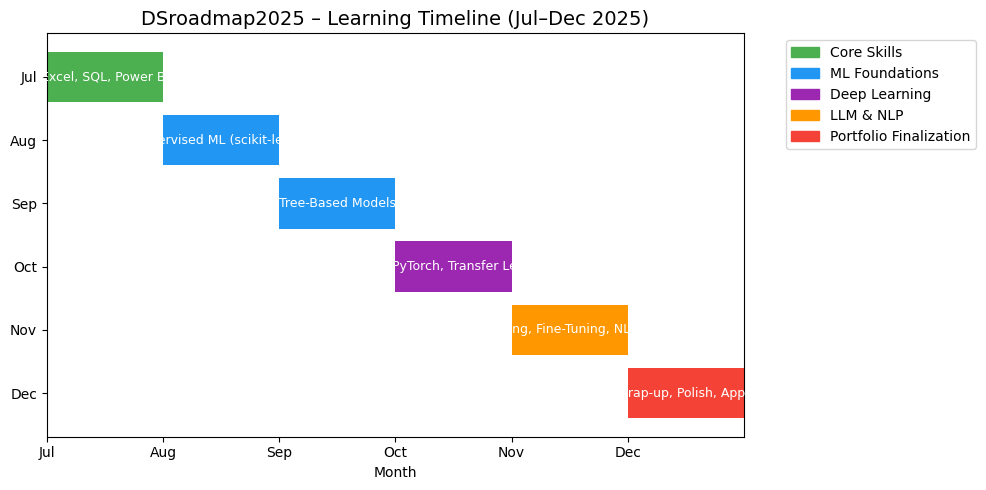

# 🧭 DSroadmap2025 

### 📈 Strengthening My Skills in Data, AI & Privacy + AI Portfolio Projects (2025)

Welcome!  
This repository documents my self-driven learning and portfolio-building journey during my 2025 career break — starting from a 3-month pause to recharge, followed by a structured return to upskilling in data science, AI, and data privacy.

- 📘 Personal notes and code from my structured learning path (DataCamp + self-learning)
- 🚀 Strategic data/AI projects aligned with real-world applications and responsible tech adoption

---

## 🧰 Tools & Skills  
**Languages**: Python, SQL  
**Libraries**: pandas, Seaborn, scikit-learn, OpenCV  
**Concepts**: EDA, Supervised ML, Unsupervised ML, LLMs, Transfer Learning, XAI, Data Privacy  
**Tools**: Jupyter, Git, GitHub, Power BI, DataCamp  
**Foundational Domains**: Data Governance, Data Security, Responsible AI

---

## ✅ Certifications & Active Learning Tracker (2025)

> _"Consistency is key — this section reflects my structured growth in analytics, AI, and data protection principles."_

| ✅ | **Course**                              | **Platform**   | **Focus Area**                    | **Completion Date** |
| - | --------------------------------------- | -------------- | --------------------------------- | ------------------- |
| ✅ | Microsoft Power BI Workshop             | BelajarPowerBI | Power BI Workshop                 | Feb 26, 2025        |
| ✅ | Introduction to Python                  | DataCamp       | Python Basics                     | Apr 17, 2025        |
| ✅ | Intermediate Python                     | DataCamp       | Python Control Structures         | Apr 27, 2025        |
| ✅ | Data Manipulation with pandas           | DataCamp       | Data Wrangling                    | Apr 29, 2025        |
| ✅ | Joining Data with pandas                | DataCamp       | Data Integration                  | May 3, 2025         |
| ✅ | Introduction to SQL                     | DataCamp       | SQL Basics                        | May 7, 2025         |
| ✅ | Intermediate SQL                        | DataCamp       | SQL Aggregations                  | May 9, 2025         |
| ✅ | Seaborn: Data Visualization             | DataCamp       | Data Visualization                | May 17, 2025        |
| ✅ | Large Language Models (LLMs) Concepts   | DataCamp       | AI Foundation                     | May 21, 2025        |
| ✅ | Understanding Artificial Intelligence   | DataCamp       | AI Basics                         | May 21, 2025        |
| ✅ | Exploratory Data Analysis in Python     | DataCamp       | EDA Techniques                    | May 22, 2025        |
| ✅ | Intro to Functions in Python            | DataCamp       | Python Functions                  | May 30, 2025        |
| ✅ | Image Processing in Python              | DataCamp       | OpenCV/Image Preprocessing        | Jun 1, 2025         |
| ✅ | Cleaning Data with Python               | DataCamp       | Data Cleaning                     | Jun 4, 2025         |
| ✅ | Statistics in Python                    | DataCamp       | Descriptive Stats + Distributions | Jun 6, 2025         |
| ✅ | Importing Data in Python (Beginner)     | DataCamp       | Data Import                       | Jun 12, 2025        |
| ✅ | Importing Data in Python (Intermediate) | DataCamp       | Data Sources + APIs               | Jun 13, 2025        |
| ✅ | Introduction to Data Privacy            | DataCamp       | Data Protection Concepts          | Jun 20, 2025        |
| ✅ | Introduction to Data Security           | DataCamp       | Cybersecurity Principles          | Jun 24, 2025        |
| ✅ | Data Governance Concepts                | DataCamp       | Compliance + Governance           | Jun 24, 2025        |
| ✅ | Data Preparation in Excel               | DataCamp       | Excel (cleaning + formulas)       | Jul 8, 2025         |

| 🔢  | Course                          | Start Now? | Energy Level  |
| --- | ------------------------------- | ---------- | ------------- |
| 1️⃣ | Introduction to Power BI        | ✅ Yes      | 🔥 Motivating |
| 2️⃣ | Data Visualization in Power BI  | ✅ Yes      | 🎨 Creative   |
| 3️⃣ | Introduction to DAX in Power BI | ✅ Yes      | 🧠 Logical    |
| 4️⃣ | Joining Data in SQL             | 🔁 After   | 🛠 Technical  |
| 5️⃣ | Analyzing Business Data in SQL  | 🔁 After   | 📊 Analytical |
| 6️⃣ | Data Analysis in Excel          | ⏳ Later    | 😴 Low energy |

> 🎯 21 certification courses completed — combining hands-on skills with foundational knowledge in Python, SQL, AI, and data governance.

📌 _Optional (Late July/August)_:  
• **Data Modeling in Power BI** — for multi-table dashboards  
• **Customer Churn Case Study** — for hands-on portfolio development  

---

📅 **July Focus:**  
`[█░░░░░░░]` *Starting July 1 – applying tools that turn raw data into insights.*

---

## 🧭 Long-Term Path: Data Scientist 2025+

> _“This roadmap supports my long-term transition into full-time data science roles by end of 2025 — combining technical fluency, ethical awareness, and real-world project delivery.”_

## 📊 Learning Timeline (Jul–Dec 2025)

### 🔄 Next Phases

**📅 August–September**  
- Resume machine learning foundations  
- Topics: supervised learning, model evaluation, tree-based models (scikit-learn)

**📅 October–November**  
- Deepen skills in deep learning and image analysis  
- Tools: PyTorch, CNNs, transfer learning  
- Focus on computer vision and real-time model deployment

**📅 November–December**  
- Explore LLM applications and data-centric AI  
- Topics: prompt engineering, fine-tuning basics, text generation pipelines  
- Tools: Hugging Face Transformers, open-source LLMs

**📌 Throughout 2025**  
- Build and document portfolio projects  
- Apply knowledge in practical, ethical, and business-aware contexts  
- Maintain consistent technical growth across Python, ML, and AI domains

---

## 🎯 Career Relevance

This roadmap is designed to support roles in:

- **Data Science & AI Engineering** – modeling, experimentation, automation  
- **Data Privacy & Governance** – ethical AI, regulatory understanding, secure data handling  
- **Cross-Functional Data Teams** – collaborating across analytics, product, and engineering

---

## 🔗 Connect With Me

- 💼 [LinkedIn](https://www.linkedin.com/in/nurulsabrina1910/)  
- 📁 [Back to Main GitHub](https://github.com/sabrinaMKE201073)

---

🚀 *I’ll continue updating this folder with upcoming lessons and project releases. Stay tuned!*
