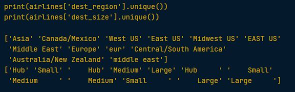

## Finding inconsistent categories
> data that are needed to be dropped

### Example 1
> This `airline` DataFrame contains flight metadata such as the airline, the destination, waiting times as well as answers to key questions regarding cleanliness, safety, and satisfaction on the San Francisco Airport.

```python
# Find the cleanliness category in airlines not in categories
cat_clean = set(airlines['cleanliness']).difference(categories['cleanliness'])

# Find rows with that category
cat_clean_rows = airlines['cleanliness'].isin(cat_clean)

# Print rows with inconsistent category
print(airlines[cat_clean_rows])
```


```python
# Print rows with consistent categories only
print(airlines[~cat_clean_rows])
```


---

### Example 2

```python
# Print unique values of both columns
print(airlines['dest_region'].unique())
print(airlines['dest_size'].unique())
```




