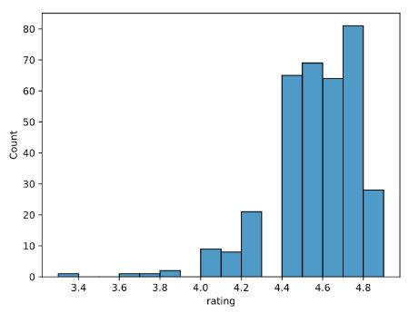
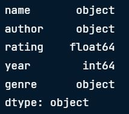

# Module 1: Getting to Know a Dataset

## 1) Functions used for Exploring Data Analysis

`.head()` - get a first few rows for take a look at our dataframe overview

`.info()` - to check on the dataframe datatype and basic info

`.value_counts()` - give a closer look for categorical columns by count function

`.describe()` - give numberical column statistics (such as count,mean, std, min,quartile, max value)

---

## 2) Visualizing numerical data (using seaborn/matplotlib)

> Classic way of numerical data distribution : Histogram

```Python
import seaborn as sns
import matplotlib.pyplot as plt
sns.histplot(data=books,
            x="rating",
            binwidth=.1)
plt.show()
```

Output : Histogram plot
  
  <left>
    
  </left>

---

## Data validation

`.dtypes()` - to check on the dataframe datatype (but sometimes it didnt give the exact correct type)

a) Update data type using `.astype()` function

```Python
books["year"] = books["year"].astype(int)
books.dtypes
```

  <left>
    
  </left>


