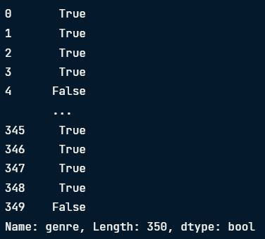
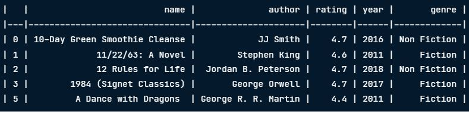
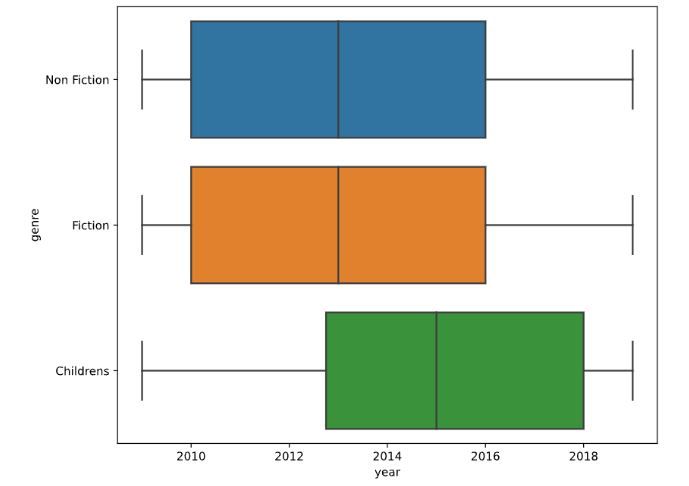
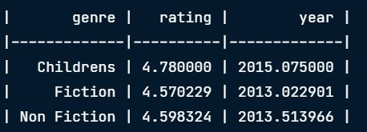
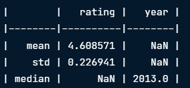
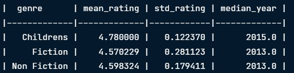
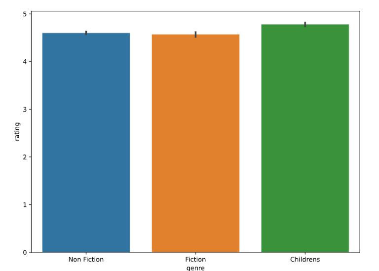

# 📘 Module 1: Getting to Know a Dataset

---

## 🧰 1. Functions for Exploring Data

| Function           | Description                                                                 |
|--------------------|-----------------------------------------------------------------------------|
| `.head()`          | Returns the first few rows – useful for a quick overview.                   |
| `.info()`          | Displays column names, non-null counts, and data types.                     |
| `.value_counts()`  | Shows counts of unique values – great for categorical columns.              |
| `.describe()`      | Summary stats for numeric columns (mean, std, min, quartiles, max).         |

---

## 📊 2. Visualizing Numerical Data

### 🔹 Histogram Example (Using Seaborn)

```python
import seaborn as sns
import matplotlib.pyplot as plt

sns.histplot(data=books, x="rating", binwidth=0.1)
plt.show()
```

<left>
  
</left>

---

## ✅ 3. Data Validation & Type Checking

### 🔍 Checking Data Types

```python
books.dtypes
```

> `.dtypes` may return `object` for columns with strings or mixed types.

---

### 🔄 Converting Data Types with `.astype()`

```python
books["year"] = books["year"].astype(int)
books.dtypes
```

<left>
  
</left>

---

### 🧮 Common Python Data Types

| Type        | Python Name |
|-------------|--------------|
| String      | `str`        |
| Integer     | `int`        |
| Float       | `float`      |
| Dictionary  | `dict`       |
| List        | `list`       |
| Boolean     | `bool`       |

---

## 🏷️ 4. Validating Categorical Data

### ✅ Using `.isin()` to Check Specific Categories

```python
books["genre"].isin(["Fiction", "Non Fiction"])
```

<left>
  
</left>

> Tip: Use `~` to invert the result and filter items **not** in the list.

---

### 🔎 Filter Rows Based on Category Match

```python
books[books["genre"].isin(["Fiction", "Non Fiction"])].head()
```

<left>
  
</left>

---

## 🧪 5. Validating Numerical Data

### 📌 Handy Functions

- `df.select_dtypes("number")` – Select numerical columns  
- `df["column"].min()` – Minimum value  
- `df["column"].max()` – Maximum value  

---

### 🔸 Boxplot Visualization by Category

```python
sns.boxplot(data=books, x="year", y="genre")
```

<left>
  
</left>

> Observation: Children's books tend to be published slightly later, but the range of years is similar across genres.

---

## 📚 6. Grouping and Aggregating Data

### 🔢 Group Data with `.groupby()`

Use `.groupby()` + aggregation method like:

- `.sum()`
- `.count()`
- `.min()`
- `.max()`
- `.mean()`
- `.var()`
- `.std()`

```python
books.groupby("genre").mean()
```

<left>
  
</left>

---

## 📊 7. Aggregating Ungrouped Data with `.agg()`

### 🔧 Apply Multiple Aggregations

```python
books.agg({"rating": ["mean", "std"], "year": ["median"]})
```

<left>
  
</left>

> `.agg()` applies multiple aggregate functions across one or more columns.

---

### 🧾 Named Summary Columns

```python
books.groupby("genre").agg(
    mean_rating=("rating", "mean"),
    std_rating=("rating", "std"),
    median_year=("year", "median")
)
```

<left>
  
</left>

> Observation: Fiction genre has the lowest average rating and the highest variation.

---

## 📉 8. Visualizing Categorical Summaries

### 📊 Using `barplot()`

```python
sns.barplot(data=books, x="genre", y="rating")
plt.show()
```

<left>
  
</left>

> Observation: Fiction books tend to have lower ratings with slightly more variation.
