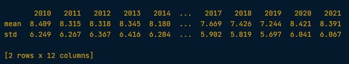
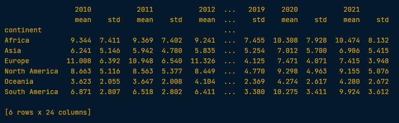

### 🔹 Exercise 1
```python
# Import the required visualization libraries
import seaborn as sns
import matplotlib.pyplot as plt

# Create a histogram of 2021 unemployment; show a full percent in each bin
sns.histplot(data=unemployment,
            x="2021",
            binwidth=1.0)
plt.show()
```

<left>
  
</left>

📌 It looks like 2021 unemployment hovered around 3% to 8% for most countries in the dataset, but a few countries experienced very high unemployment of 20% to 35%.

---

### 🔹 Exercise 2

Question: Visualization Range of unemployment rates in each continent in the year of 2021 

```python
# Print the minimum and maximum unemployment rates during 2021
print(unemployment["2021"].min(), unemployment["2021"].max())

# Create a boxplot of 2021 unemployment rates, broken down by continent
sns.boxplot(data=unemployment, x="2021", y="continent")
plt.show()
```

<left>
  
</left>

📌 Notice how different the ranges in unemployment are between continents. For example, Africa's 50th percentile is lower than that of North America, but the range is much wider.

---

### 🔹 Exercise 3 (using .groupby() and .agg()

Question A: 
Print the mean and standard deviation of the unemployment rates for each year (in that order).

```python
print(unemployment.agg(["mean", "std"]))
```

<left>
  
</left>

Question B: 
Print the mean and standard deviation (in that order) of the unemployment rates for each year, grouped by continent.

```python
print(unemployment.groupby("continent").agg(["mean", "std"]))
```

<left>
  
</left>


