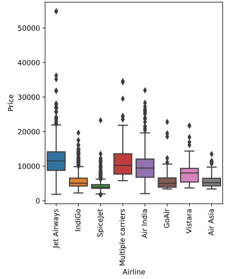
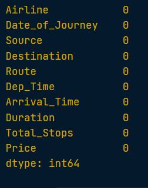
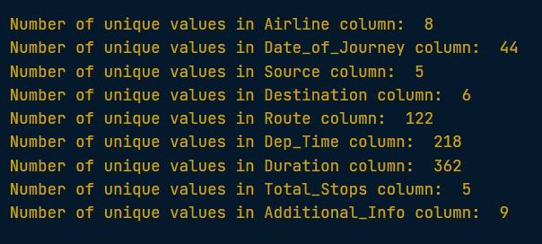

### 🔍 Checking/count for missing values

df.isna().sum() 
> this will show the total missing values

```python
# Count the number of missing values in each column
print(planes.isna().sum())
```

<left>
  
</left>

---

### 💡 Strategies for addressing missing data
Step 1: Drop missing values
> 5% or less of total values

Step 2: Impute mean, median, mode
> Depends on distribution and context

Step 3: Impute by sub-group
> Different experience levels have different median salary

---

```python
# Find the five percent threshold
threshold = len(planes) * 0.05

# Create a filter
cols_to_drop = planes.columns[planes.isna().sum() <= threshold]

# Drop missing values for columns below the threshold
planes.dropna(subset=cols_to_drop, inplace=True)

print(planes.isna().sum())
```

<left>
  
</left>

🧠 By creating a missing values threshold and using it to filter columns, you've managed to remove missing values from all columns except for "Additional_Info" and "Price".

---

### Strategies for remaining missing data "Additional_Info" and "Price"

```python
# Check the values of the Additional_Info column
print(planes["Additional_Info"].value_counts())

# Create a box plot of Price by Airline
sns.boxplot(data=planes, x="Airline", y="Price")
plt.xticks(rotation=90) 

plt.show()
```

<left>
  
</left>

<left>
  
</left>

### Imputing missing plane prices
```python
# Calculate median plane ticket prices by Airline
airline_prices = planes.groupby("Airline")["Price"].median()

print(airline_prices)

# Convert to a dictionary
prices_dict = airline_prices.to_dict()

# Map the dictionary to missing values of Price by Airline
planes["Price"] = planes["Price"].fillna(planes["Airline"].map(prices_dict))

# Check for missing values
print(planes.isna().sum()) 
```

<left>
  
</left>

🧠 By remove the "Additional_Info" column and impute the median by "Airline" for missing values of "Price", we've managed to remove all missing values from all columns.

---

### Finding the number of unique values

```python
# Filter the DataFrame for object columns
non_numeric = planes.select_dtypes("object")

# Loop through columns
for column in non_numeric.columns:
  
  # Print the number of unique values
  print(f"Number of unique values in {column} column: ", non_numeric[column].nunique())
```
<left>
  
</left>


