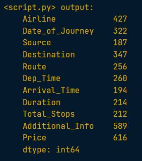
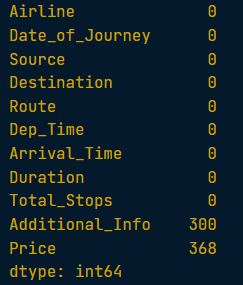
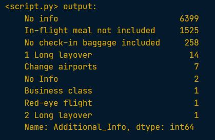

### 🔍 Checking/count for missing values

df.isna().sum() 
> this will show the total missing values

```python
# Count the number of missing values in each column
print(planes.isna().sum())
```

<left>
  
</left>

---

### 💡 Strategies for addressing missing data
Step 1: Drop missing values
> 5% or less of total values

Step 2: Impute mean, median, mode
> Depends on distribution and context

Step 3: Impute by sub-group
> Different experience levels have different median salary

---

```python
# Find the five percent threshold
threshold = len(planes) * 0.05

# Create a filter
cols_to_drop = planes.columns[planes.isna().sum() <= threshold]

# Drop missing values for columns below the threshold
planes.dropna(subset=cols_to_drop, inplace=True)

print(planes.isna().sum())
```

<left>
  
</left>

🧠 By creating a missing values threshold and using it to filter columns, you've managed to remove missing values from all columns except for "Additional_Info" and "Price".

---

### Strategies for remaining missing data

To print the values and frequencies of the Additional_Info column in a pandas DataFrame, you can use the .value_counts() method

```python
print(planes["Additional_Info"].value_counts())
```

<left>
  
</left>


