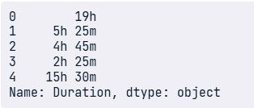
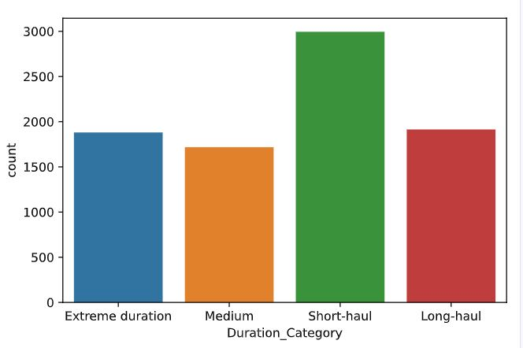
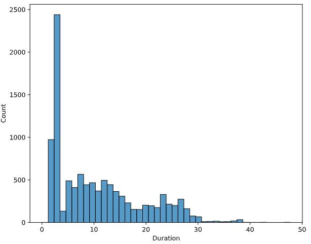

### 🔍 Checking/count for missing values

df.isna().sum() 
> this will show the total missing values

```python
# Count the number of missing values in each column
print(planes.isna().sum())
```

<left>
  
</left>

---

### 💡 Strategies for addressing missing data
Step 1: Drop missing values
> 5% or less of total values

Step 2: Impute mean, median, mode
> Depends on distribution and context

Step 3: Impute by sub-group
> Different experience levels have different median salary

---

```python
# Find the five percent threshold
threshold = len(planes) * 0.05

# Create a filter
cols_to_drop = planes.columns[planes.isna().sum() <= threshold]

# Drop missing values for columns below the threshold
planes.dropna(subset=cols_to_drop, inplace=True)

print(planes.isna().sum())
```

<left>
  
</left>

🧠 By creating a missing values threshold and using it to filter columns, you've managed to remove missing values from all columns except for "Additional_Info" and "Price".

---

### Strategies for remaining missing data "Additional_Info" and "Price"

```python
# Check the values of the Additional_Info column
print(planes["Additional_Info"].value_counts())

# Create a box plot of Price by Airline
sns.boxplot(data=planes, x="Airline", y="Price")
plt.xticks(rotation=90) 

plt.show()
```

<left>
  
</left>

<left>
  
</left>

### Imputing missing plane prices
```python
# Calculate median plane ticket prices by Airline
airline_prices = planes.groupby("Airline")["Price"].median()

print(airline_prices)

# Convert to a dictionary
prices_dict = airline_prices.to_dict()

# Map the dictionary to missing values of Price by Airline
planes["Price"] = planes["Price"].fillna(planes["Airline"].map(prices_dict))

# Check for missing values
print(planes.isna().sum()) 
```

<left>
  
</left>

🧠 By remove the "Additional_Info" column and impute the median by "Airline" for missing values of "Price", we've managed to remove all missing values from all columns.

---

### Finding the number of unique values

```python
# Filter the DataFrame for object columns
non_numeric = planes.select_dtypes("object")

# Loop through columns
for column in non_numeric.columns:
  
  # Print the number of unique values
  print(f"Number of unique values in {column} column: ", non_numeric[column].nunique())
```
<left>
  
</left>

---
### Flight duration categories in object type such as `5h 25m'

<left>
  
</left>


```python
# Create a list of categories
flight_categories = ["Short-haul", "Medium", "Long-haul"]

short_flights = "^0h|^1h|^2h|^3h|^4h"
medium_flights = "^5h|^6h|^7h|^8h|^9h"
long_flights = "^10h|^11h|^12h|^13h|^14h|^15h|^16h"
```

### Adding duration categories

```python
# Create conditions for values in flight_categories to be created
conditions = [
    (planes["Duration"].str.contains(short_flights)),
    (planes["Duration"].str.contains(medium_flights)),
    (planes["Duration"].str.contains(long_flights))
]

# Apply the conditions list to the flight_categories
planes["Duration_Category"] = np.select(conditions, 
                                        flight_categories,
                                        default="Extreme duration")

# Plot the counts of each category
sns.countplot(data=planes, x="Duration_Category")
plt.show()
```

<left>
  
</left>

🧠 It's clear that the majority of flights are short-haul, and virtually none are longer than 16 hours!


---

### Data cleaning for `Duration` column and convert it to the correct data type float for analysis

```python
# Preview the column
print(planes["Duration"].head())

# Remove the string character
planes["Duration"] = planes["Duration"].str.replace("h", "")

# Convert to float data type
planes["Duration"] = planes["Duration"].astype(float)

# Plot a histogram
sns.histplot(planes["Duration"])
plt.show()
```
<left>
  
</left>

