# 📊 **Relationships in Data using Pandas & Seaborn**

---

## 🕰️ **Patterns Over Time**

To analyze trends and seasonality, we must ensure date-related columns are properly formatted.

---

### 🧹 Step 1: Ensure Proper DateTime Format

> 📝 Pandas may treat date columns as strings (`object` type), so converting them to `datetime` is key for time-based analysis.

#### ✅ Option 1: Convert during import

```python
divorce = pd.read_csv("divorce.csv", parse_dates=["marriage_date"])
```

#### ✅ Option 2: Convert after import

```python
divorce["marriage_date"] = pd.to_datetime(divorce["marriage_date"])
```

---

### 🛠️ Step 2: Combine Multiple Columns into One Date

If dates are split into year, month, and day columns:

```python
divorce["marriage_date"] = pd.to_datetime(divorce[["month", "day", "year"]])
```

<left>
  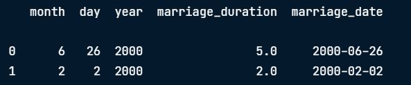
</left>

---

### 🔍 Step 3: Extract Date Components

Use `.dt` to pull out specific parts like month, year, or weekday:

```python
divorce["marriage_month"] = divorce["marriage_date"].dt.month
```

<left>
  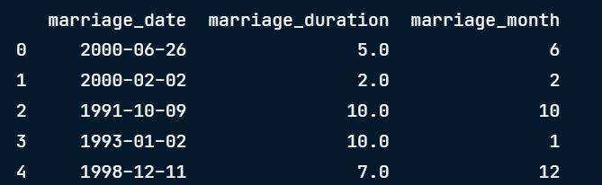
</left>

---

## 📈 **Line Plot for Time Patterns**

> Line plots are great for showing how a numeric variable changes over time.

```python
sns.lineplot(data=divorce, x="marriage_month", y="marriage_duration")
plt.show()
```

<left>
  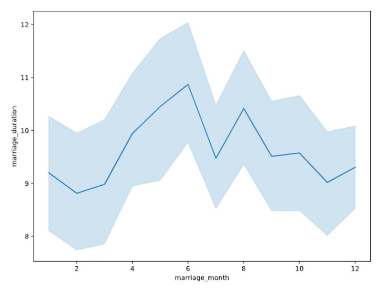
</left>

---

### 📌 Interpretation:

- The line shows the **average marriage duration** for each month.
- The shaded area is the **95% confidence interval (CI)**.
- A **wider CI** suggests more variation—look into possible outliers or subgroups.

---

## 🔗 Correlation Analysis

> Understand how two variables move together—linearly.

### 1️⃣ Using `.corr()` in Pandas

```python
divorce.corr()
```

<left>
  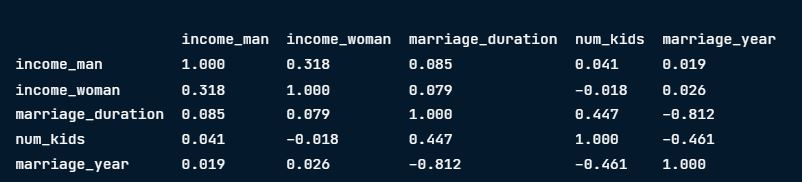
</left>

📌 A value:
- Close to **0** = weak relationship  
- Close to **1 or -1** = strong relationship

### 2️⃣ Correlation Heatmap with Seaborn

```python
sns.heatmap(divorce.corr(), annot=True)
plt.show()
```
📌 Colors help spot trends:
- 👍🏼 Light (e.g., beige): strong **positive** correlation  
- 🍇 Dark (e.g., deep purple): strong **negative** correlation  

🧠 Example: `marriage_year` vs. `marriage_duration` shows a strong negative correlation (-0.81) since marriages in earlier years had more time to last longer.

<left>
  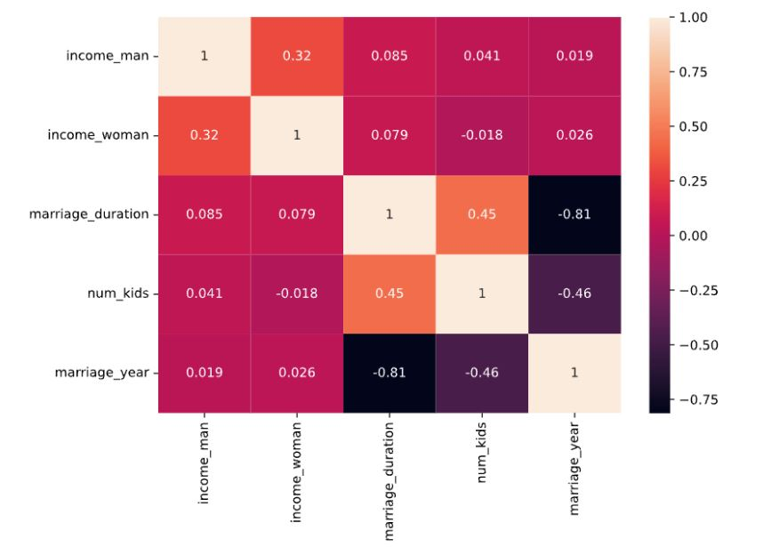
</left>

### Correlation in context
```python
divorce["divorce_date"].min() #Output: Timestamp ('2000-01-08 00:00:00')
divorce["divorce_date"].max() #Output: Timestamp ('2015-11-03 00:00:00')
```

📌 Keypoint: Since our dataset is about marriages that ended between 2000 to 2015, marriages that started in earlier years will by definition have a longer duration compared to those that started in later ones.

---

## 🔍 **Beyond Linear: Visualizing Relationships**

Correlation doesn't capture non-linear patterns. Use visual tools to explore further.

<left>
  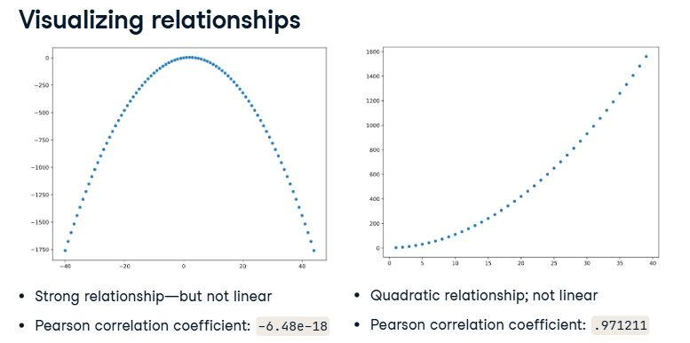
</left>

### 📉 Scatter Plots

Simple yet effective to see patterns between two numeric variables.

```python
sns.scatterplot(data=divorce,x="marriage_duration", y="num_kids")
plt.show()
```

<left>
  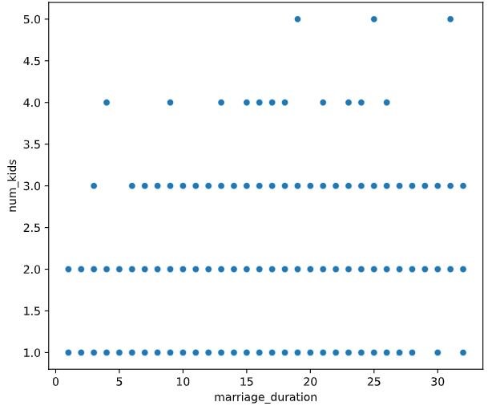
</left>

---

### 🔗 Pair Plots

> A grid of scatter plots showing all combinations of numeric variables.

```python
sns.pairplot(data=divorce)
```

<left>
  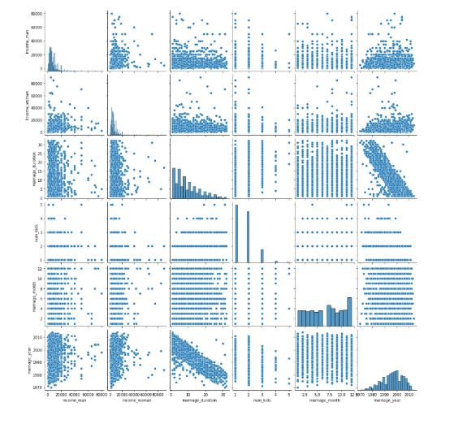
</left>

---

For specific variables:

```python
sns.pairplot(data=divorce, vars=["income_man", "income_woman", "marriage_duration"])
```

<left>
  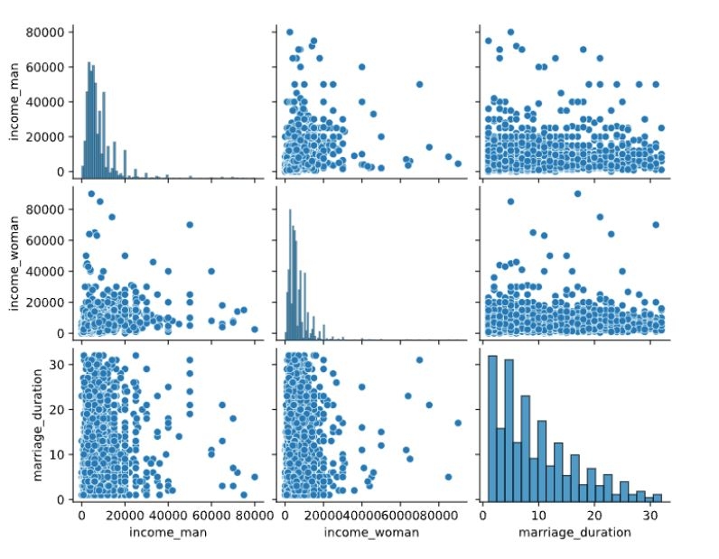
</left>

📌 When income vs. marriage duration shows scattered points, it suggests **no strong relationship**.

---

## 🎯 **Categorical Factors & Distributions**

Let’s see how **education levels** affect marriage duration.

### 📊 Education Level Distribution

```python
divorce["education_man"].value_counts()
```

<left>
  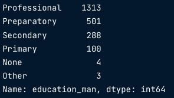
</left>

📌 Most men have an education level between primary and professional levels.

---

### 📉 Histogram by Category

```python
sns.histplot(data=divorce,
            x="marriage_duration",
            hue="education_man",
            binwidth=1) 
plt.show() 
```
<left>
  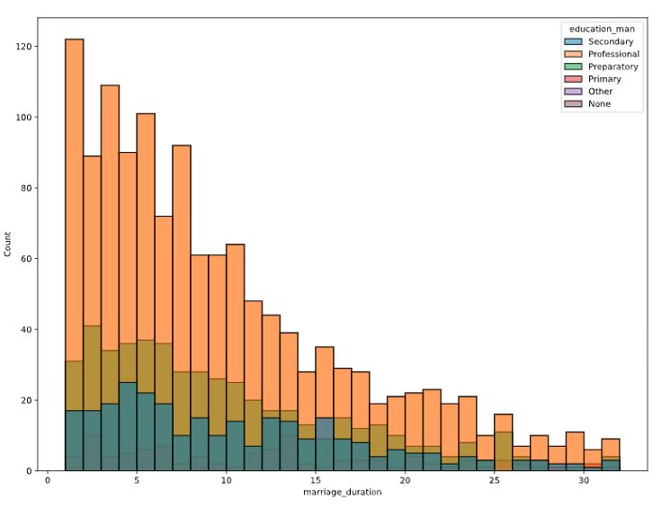
</left>

📌 Stacked bars can be hard to interpret.

---

### 3) 📈 Kernel Density Estimate (KDE) plots
> Kernel Density Estimate (KDE) plots are a great alternative to histograms when you want to show multiple distributions in the same visual

```python
sns.kdeplot(data=divorce,
            x="marriage_duration",
            hue="education_man") 
plt.show() 
```
<left>
  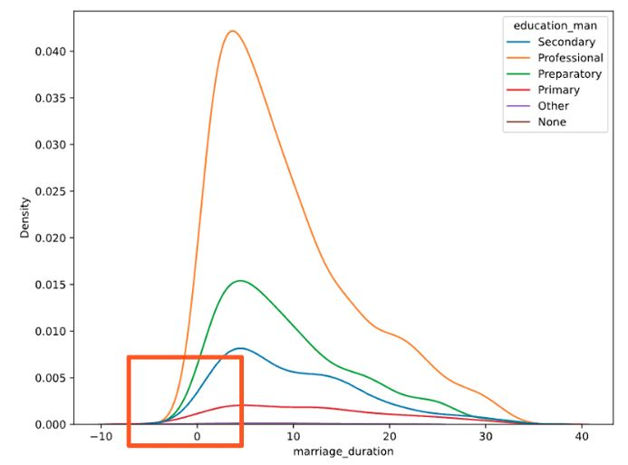
</left>

📌 Easier to see the peak marriage duration for each education level, but curves can include unrealistic values.

---

### 🛠 Fix KDE Plot with `cut=0`

```python
sns.kdeplot(data=divorce,
            x="marriage_duration",
            hue="education_man"
            cut=0) 
plt.show() 
```
<left>
  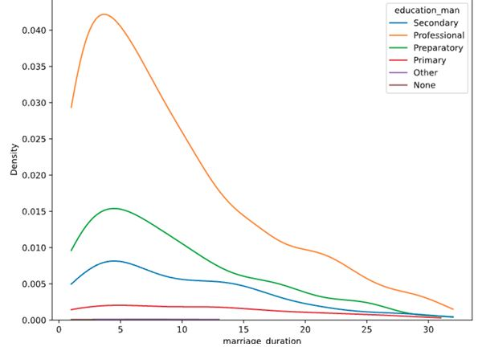
</left>

📌 Limits the curve to valid duration values only.

---

### 📈 Cumulative KDE Plot

```python
sns.kdeplot(data=divorce,
            x="marriage_duration",
            hue="education_man"
            cut=0,
            cumulative=True) 
plt.show() 
```
<left>
  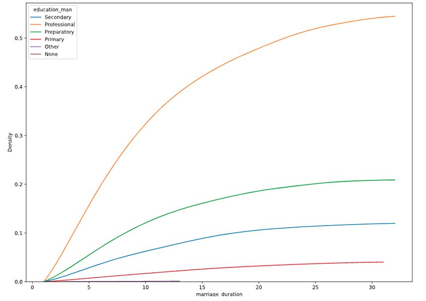
</left>

📌 Shows the **cumulative distribution**, useful for comparing groups.

---

## 👩‍❤️‍👨 **Marriage Age vs Education Level**

Create age-at-marriage columns:

```python
divorce["man_age_marriage"] = divorce["marriage_year"] - divorce["dob_man"].dt.year 
divorce["woman_age_marriage"] = divorce["marriage_year"] - divorce["dob_woman"].dt.year
```

### 📉 Scatter Plot by Education Level

```python
sns.scatterplot(data=divorce,  
                x="woman_age_marriage", 
                y="man_age_marriage",  
                hue="education_man") 
plt.show() 
```
<left>
  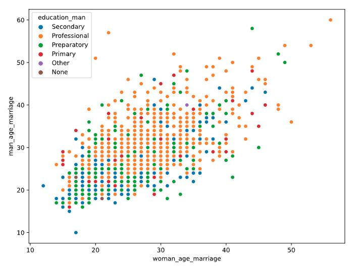
</left>

📌 Orange dots (professional education) show men may marry later in life.

---

## ✅ Final Thoughts

You've now explored:
- Time-based analysis using datetime
- Visualizing trends with line plots
- Understanding linear and non-linear relationships
- Using KDE and pair plots for distributions
- Analyzing categorical effects on numeric outcomes

🎯 These skills are fundamental for building insightful data stories. Great job!
