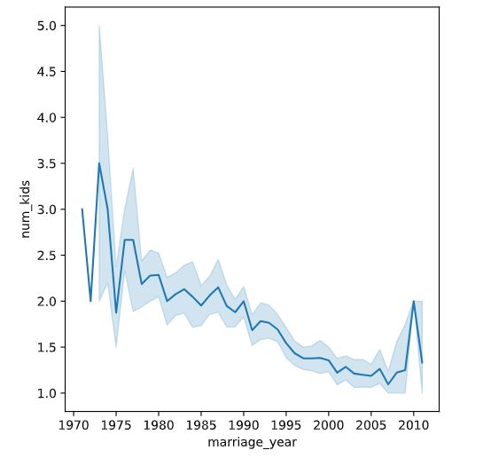
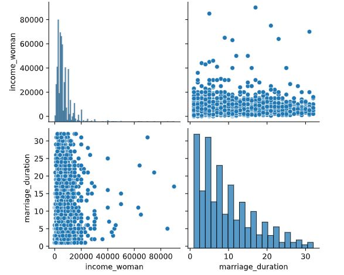
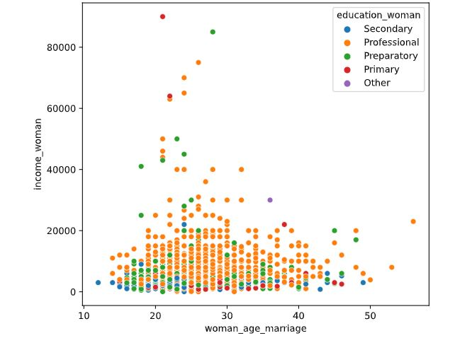

## Visualizing relationships over time
Q1: Create a line plot showing the average number of kids a couple had during their marriage, arranged by the year that the couple got married.

```python
# Define the marriage_year column
divorce["marriage_year"] = divorce["marriage_date"].dt.year

# Create a line plot showing the average number of kids by year
sns.lineplot(data=divorce, x="marriage_year", y="num_kids")
plt.show()
```

<left>
  
</left>

📌 it looks like couples who had later marriage years also had fewer children during their marriage.

---

## Visualizing multiple variable relationships
Q2: Create a pairplot to visualize the relationships between income_woman and marriage_duration in the divorce DataFrame.

```python
# Create a pairplot for income_woman and marriage_duration
sns.pairplot(data=divorce, vars=["income_woman", "marriage_duration"])
plt.show()
```

<left>
  
</left>

📌 Just as in the correlation matrix, you can see that the relationship between income_woman and marriage_duration is not a strong one

---

## Categorical data in scatter plots
Q3: Create a scatter plot that shows woman_age_marriage on the x-axis and income_woman on the y-axis; each data point should be colored based on the woman's level of education, represented by education_woman.

```python
# Create the scatter plot
sns.scatterplot(data=divorce,  
                x="woman_age_marriage", 
                y="income_woman",  
                hue="education_woman") 
plt.show()
```

<left>
  
</left>

📌 There is a positive correlation between professional education and higher salaries, as you might expect. The relationship between women's age at marriage and education level is a little less clear.


