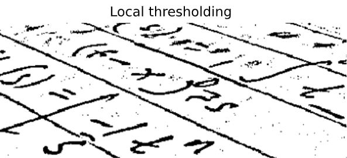
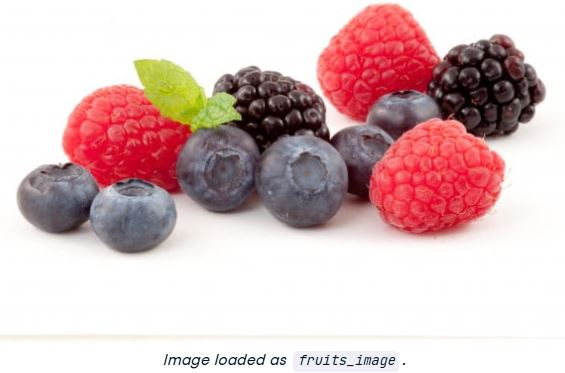

# 🖼️ PART 1 : Image Processing Exercises with scikit-image

### 🌀 Exercise 1: Flip it!


```python
# Flip the image vertically
seville_vertical_flip = np.flipud(flipped_seville)

# Flip the image horizontally
seville_horizontal_flip = np.fliplr(seville_vertical_flip)

# Show the resulting image
show_image(seville_horizontal_flip, 'Seville')
```
<p align="center">
  
</p>


---

### 📊 Exercise 2: Red Hot Histogram


```python
# Obtain the red channel
red_channel = image[:, :, 0]

# Plot the red histogram with bins in a range of 256
plt.hist(red_channel.ravel(), bins=256)

# Set title and show
plt.title('Red Histogram')
plt.show()
```
<p align="center">
  
</p>

📌 *This histogram shows a warm reddish tone—most pixels range between 0–150.*

---

### 🌓 Exercise 3: Go Binary with Global Threshold


```python
# Import the otsu threshold function
from skimage.filters import threshold_otsu

# Make the image grayscale using rgb2gray
chess_pieces_image_gray = rgb2gray(chess_pieces_image)

# Obtain the optimal threshold value with otsu
thresh = threshold_otsu(chess_pieces_image_gray)

# Apply thresholding to the image
binary = chess_pieces_image_gray > thresh

# Show the image
show_image(binary, 'Binary image')
```
<p align="center">
  
</p>

---

### 🌗 Exercise 4: Uneven Background? Try Local Threshold


```python
global_thresh = threshold_otsu(page_image)

# Obtain the binary image by applying global thresholding
binary_global = page_image > global_thresh

# Show the binary image obtained
show_image(binary_global, 'Global thresholding')
```
<p align="center">
  
</p>

📌 *Global thresholding can miss some text when the background isn't uniform.*

```python
# Import the local threshold function
from skimage.filters import threshold_local

# Set the block size to 35
block_size = 35

# Obtain the optimal local thresholding
local_thresh = threshold_local(page_image, block_size, offset=10)

# Obtain the binary image by applying local thresholding
binary_local = page_image > local_thresh

# Show the binary image
show_image(binary_local, 'Local thresholding')
```
<p align="right">
  
</p>

📌 *Local thresholding shines when dealing with varied lighting.*

---


### 🧪 Exercise 5: Test All Thresholds!



```python
# Import the try all function
from skimage.filters import try_all_threshold

# Import the rgb to gray convertor function 
from skimage.color import rgb2gray

# Turn the fruits_image to grayscale
grayscale = rgb2gray(fruits_image)

# Use the try all method on the resulting grayscale image
fig, ax = try_all_threshold(grayscale, verbose=False)

# Show the resulting plots
plt.show()
```
<p align="center">
  
</p>

📌 From all of the above thresholding method, this image works good with some global thresholding methods (like the "Yen" and "Mean") and not so well in others, (like the "Minimum").

---

### 🛠️ Exercise 6: Binarize Those Tools


```python
# Import threshold and gray convertor functions
from skimage.filters import threshold_otsu
from skimage.color import rgb2gray

# Turn the image grayscale
gray_tools_image = rgb2gray(tools_image)

# Obtain the optimal thresh
thresh = threshold_otsu(gray_tools_image)

# Obtain the binary image by applying thresholding
binary_image = gray_tools_image > thresh

# Show the resulting binary image
show_image(binary_image, 'Binarized image')
```

<p align="center">
  
</p>

# 🖼️ PART 2 : Filters, Contrast, Transformation and Morphology

### Exercise 1: Edge detection


```python
# Import the color module
from skimage import color

# Import the filters module and sobel function
from skimage.filters import sobel

# Make the image grayscale
soaps_image_gray = color.rgb2gray(soaps_image)

# Apply edge detection filter
edge_sobel = sobel(soaps_image_gray)

# Show original and resulting image to compare
show_image(soaps_image, "Original")
show_image(edge_sobel, "Edges with Sobel")
```

<p align="center">
  
</p>

📌 The edges of all the figures in the scene are highlighted.


