# Introduction to Image Processing & scikit-image


## What is image processing?
> subset of computer vision

Operations to on images and videos to:
- Enhance an image
- Extract useful information
- Analyze it and make decisions

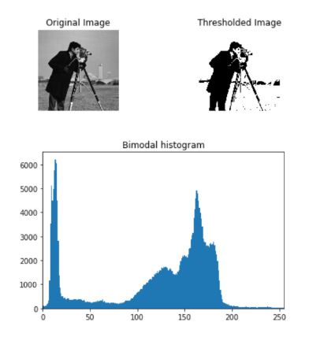

### Purposes

1) Visualization
> Objects that are not visible

2) Image sharpening and restoration
> A better image

3) Image retrieval
> Seek for the image of interest
      
4) Measurement of pattern
> Measures various objects

5) Image Recognition
> Distinguish objects in an image

---

## What is an image?
A digital image is an array/matrix/square pixels which arranged in columns & rows (2-dimensional matrix)

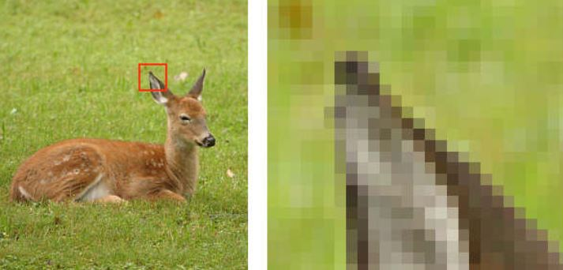

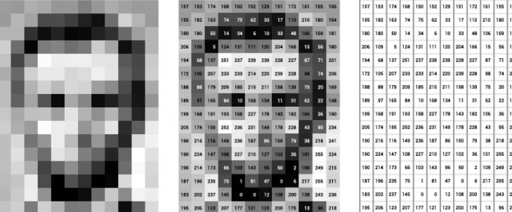

--- 

## Import image for scikit-image

```python
from skimage import data
rocket_image = data.rocket()
```
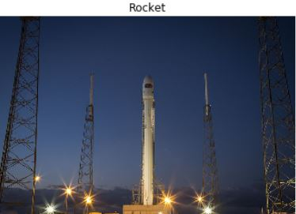

## RGB vs Grayscale color

```python
from skimage import color
grayscale = color.rgb2gray(original)
rgb = color.gray2rgb(grayscale)
```
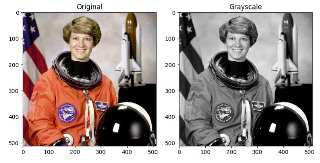

```python
#using matplotlib function to show image
show_image(grayscale, "Grayscale")
```
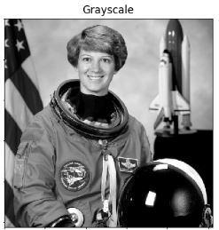

---

### Exercise: RGB to grayscale

```python
# Import the modules from skimage
from skimage import data, color

# Load the rocket image
rocket = data.rocket()

# Convert the image to grayscale
gray_scaled_rocket = color.rgb2gray(rocket)

# Show the original image
show_image(rocket, 'Original RGB image')

# Show the grayscale image
show_image(gray_scaled_rocket, 'Grayscale image')
```

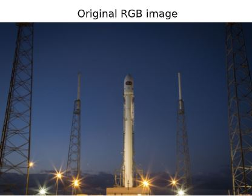
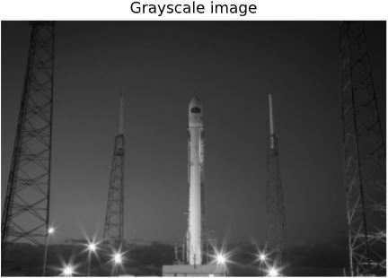


---

## Numpy for Images

Fundamentals of image processing
techniques
- Flipping
- Extract and analyze features

```python
#load image using Matplotlib
madrid_image = plt.imread('/madrid.jpeg')

type(madrid_image)   #output: <class 'numpy.ndarray'>
```

### Colors with Numpy

1) Default colormap in RGB

```python
# Obtaining the red values of the image
red image[:, :, 0]

# Obtaining the green values of the image
green image [:, :, 1]

# Obtaining the blue values of the image
blue = image[:, :, 2]
```
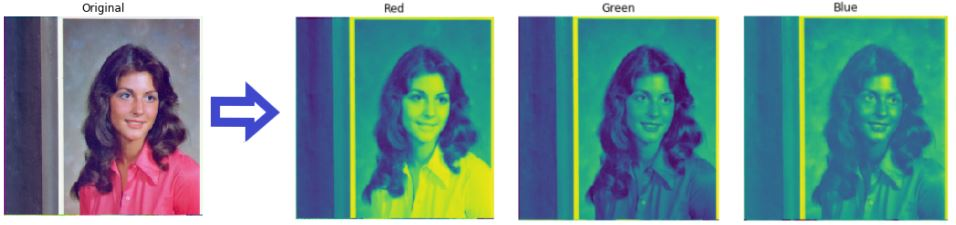

🖊️ The picture is displayed in the default colormap, different intensities in each tone


2) Gray colormap in RGB

```python
plt.imshow(red, cmap="gray")
plt.title('Red')
plt.axis('off')
plt.show()
```


### Shapes & Sizes
> To accessing the shape & size of this image:

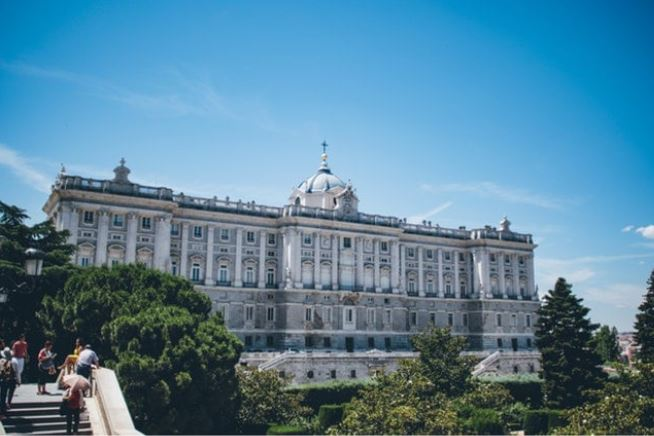

```python
madrid_image.shape  #shape of (426, 640, 3)

madrid_image.size   #817920
```
🖊️ The picture displayed consist the height of 426, width of 640 and 3 color of representation (RGB-3 image).

Next, the image consist of 817920 total number of pixels.

---

### Flipping images 

1) vertically
```python
vertically_flipped = np.flipud(madrid_image)
show_image(vertically_flipped,'Vertically flipped image')
```

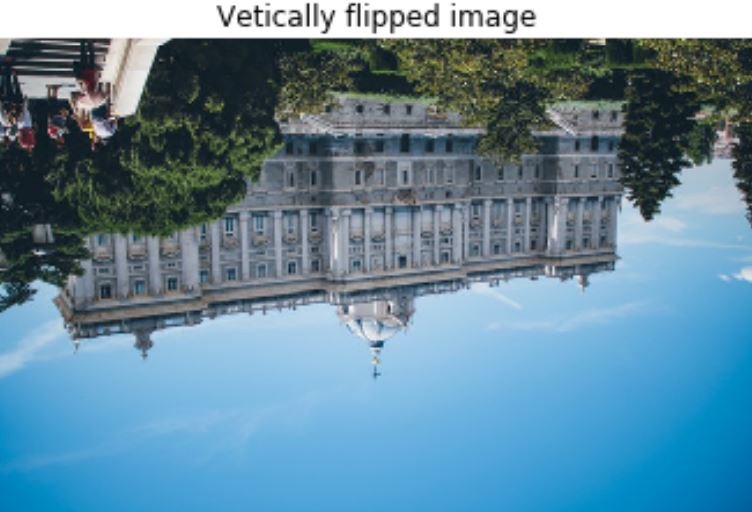

2) horizontally

```python
horizontally_flipped = np.fliplr(madrid_image)
show_image(horizontally_flipped,'Horizontally flipped image')
```

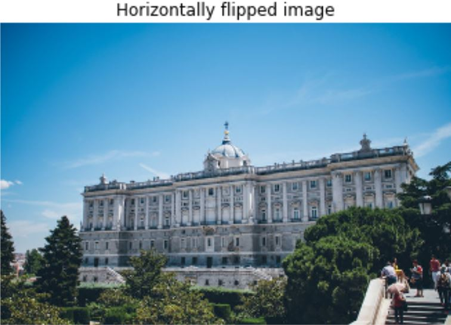

---


--- 

## Thresholding


