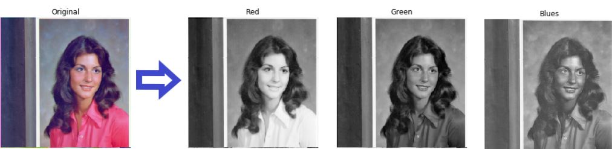
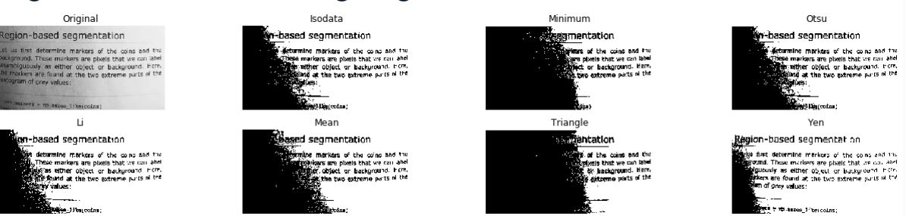

# 🎨 Introduction to Image Processing & scikit-image


## What is image processing?
> A subfield of computer vision — where pixels meet purpose!

You can:
- Enhance images 🪄
- Extract insights 🔍
- Analyze visuals & make decisions 🧠

---

## 🔍 Why Use Image Processing?

1. **See the Unseen** — Reveal hidden details  
2. **Sharpen & Restore** — Clear up blurry images  
3. **Search Images** — Find what you're looking for  
4. **Measure Patterns** — Quantify shapes & features  
5. **Recognize Objects** — Spot people, faces, cats 😺

---

## 🧱 What is an image?
A digital image is an array/matrix/square pixels which arranged in columns & rows (2-dimensional matrix)


--- 

## 🛠️ Load Images with `scikit-image`

```python
from skimage import data
rocket_image = data.rocket()
```


## 🌈 RGB vs Grayscale color

```python
from skimage import color
grayscale = color.rgb2gray(original)
rgb = color.gray2rgb(grayscale)
```


```python
#using matplotlib function to show image
show_image(grayscale, "Grayscale")
```


---

### ✏️ Exercise: RGB ➡️ grayscale

```python
# Import the modules from skimage
from skimage import data, color

# Load the rocket image
rocket = data.rocket()

# Convert the image to grayscale
gray_scaled_rocket = color.rgb2gray(rocket)

# Show the original image
show_image(rocket, 'Original RGB image')

# Show the grayscale image
show_image(gray_scaled_rocket, 'Grayscale image')
```


---

## 🧮 NumPy for Image Manipulation

Fundamentals of image processing
techniques
- Flipping
- Extract and analyze features

```python
#load image using Matplotlib
madrid_image = plt.imread('/madrid.jpeg')

type(madrid_image)   #output: <class 'numpy.ndarray'>
```

### 🎨 Colors with Numpy

1) Default colormap in RGB

```python
red = image[:, :, 0]
green = image[:, :, 1]
blue = image[:, :, 2]
```


🖊️ The picture is displayed in the default colormap, different intensities in each tone


2) Gray colormap in RGB

```python
plt.imshow(red, cmap="gray")
plt.title('Red')
plt.axis('off')
plt.show()
```


### Image Shape & Size


```python
madrid_image.shape  # (426, 640, 3)
madrid_image.size   # 817920
```
🖊️ The picture displayed consist the height of 426, width of 640 and 3 color of representation (RGB-3 image).

Next, the image consist of 817920 total number of pixels.

---

### 🔄 Flip Images

1) Vertical:

```python
vertically_flipped = np.flipud(madrid_image)
show_image(vertically_flipped,'Vertically flipped image')
```


2) Horizontal:

```python
horizontally_flipped = np.fliplr(madrid_image)
show_image(horizontally_flipped,'Horizontally flipped image')
```


---

## 📊 What is histogram?
Represents pixel intensity from 0 (black) to 255 (white).

Use it to:
- Adjust brightness/contrast
- Perform thresholding
- Analyze images


📌The first image is really dark (which consist of low intensity 0-50 range of gray levels) whereas the second image is lighter and has most of the pixels between 200-255 range)

```python
red = image[:, :, 0]
plt.hist(red.ravel(), bins=256)
plt.title('Red Histogram')
plt.show()
```


--- 

## ⚫ Thresholding = B&W Magic

Split an image into foreground (white) & background (black)


Application of thresholding
- Object detection
- Face detection

```python
thresh = 127
binary = image > thresh
show_image(image,'Original')
show_image(binary,'Thresholded')
```


## 🔄 Inverted threshold

```python
inverted_binary = image <= thresh
```


## 🧪 Thresholding Techniques

- Global: Simple, for uniform lighting
- Local (adaptive): For uneven lighting

### Try all thresholds techniques:

```python
from skimage.filters import try_all_threshold
fig, ax = try_all_threshold(image, verbose=False)

show_plot(fig, ax)
```



---

## ✅ Global Threshold with Otsu

```python
from skimage.filters import threshold_otsu

thresh = threshold_otsu(image)
binary_global = image > thresh
```


## 🧠 Local Thresholding

```python
from skimage.filters import threshold_local

block_size = 35
local_thresh = threshold_local(text_image, block_size, offset=10)
binary_local = text_image > local_thresh
```


### 💡 Summary

Image processing lets you twist, flip, sharpen, and understand pictures at a pixel level using Python & scikit-image. 

Time to get hands-on and pixel-smart!


