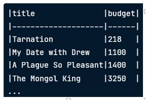
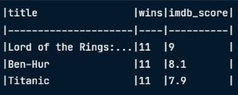
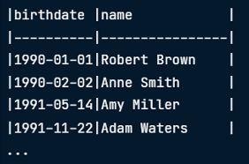

<table align="center">
  <tr>
    <td valign="middle">
      <h1>Intermediate SQL using PostgreSQL</h1>
    </td>
    <td valign="middle">
      
    </td>
  </tr>
</table>

---
## Topic 1: Selecting Data

COUNT()
LIMIT


---
## Topic 2: Filtering Records


---
## Topic 3: Aggregate functions


---
## 📘 Topic 4: Sorting & Grouping in SQL

### 1️⃣ `ORDER BY` Clause  
Sorts a column alphabetically (A-Z) by default.

---

### 2️⃣ Ascending Order: `ASC`

```sql
SELECT title, budget
FROM films
ORDER BY budget ASC;
```

🖼️ Output:  
<p align="left">
  
</p>

---

### 3️⃣ Descending Order: `DESC`

```sql
SELECT title, budget
FROM films
ORDER BY budget DESC;
```

🖼️ Output:  
<p align="left">
  
</p>

📝 **Exclude NULL values**  
To clean up your output and avoid `NULL`, add a `WHERE` clause:

```sql
SELECT title, budget
FROM films
WHERE budget IS NOT NULL 
ORDER BY budget DESC;
```

🖼️ Output:  
<p align="left">
  
</p>

---

### 4️⃣ Sorting by Multiple Fields

#### 🔸 Example: Same Sort Direction (`DESC`)

```sql
SELECT title, wins, imdb_score
FROM best_movies
ORDER BY wins DESC, imdb_score DESC;
```

🖼️ Output:  
<p align="left">
  
</p>

#### 🔸 Example: Mixed Sort Directions (ASC & DESC)

```sql
SELECT birthdate, name
FROM people
ORDER BY birthdate ASC, name DESC;
```

🖼️ Output:  
<p align="left">
  
</p>

### 5️⃣ Grouping the data

```sql
SELECT
  certification,
  language, COUNT(title) AS title_count
FROM films
GROUP BY certification, language;

```


### 6️⃣ Filtered the grouped data
📝 **HAVING**  
- If using aggregate function, while grouping by category, must use `HAVING` instead of `WHERE` clause, 
because if not, it will give error output

- `HAVING` is for fitering GROUP records
- `WHERE` is for filtering INDIVIDUAL records

#### 🔹 Example: Using of HAVING function 

```sql
SELECT
  release_year,
  COUNT(title) AS title_count
FROM films
GROUP BY release_year
HAVING COUNT(title) > 10;

```

---

### ✅ Summary

| Clause | Description |
|--------|-------------|
| `ORDER BY` | Sorts records by specified column(s) |
| `ASC` | Sort in ascending order |
| `DESC` | Sort in descending order |
| Multiple fields | Separate by comma and define order per field |

---


  
---
