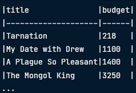
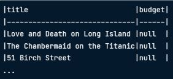

<table align="center">
  <tr>
    <td valign="middle">
      <h1>Intermediate SQL using PostgreSQL</h1>
    </td>
    <td valign="middle">
      
    </td>
  </tr>
</table>

---
## Topic 1: Selecting Data

---
## Topic 2: Filtering Records

---
## Topic 3: Aggregate functions

---
## Topic 4: Sorting & Grouping

**1) ORDER BY** 
- this function will sort a column alphabetically(A-Z by default)

**2) ASC** (sort type: Ascending) 

* SQL code:
<pre>
<code>
SELECT title,budget
FROM films
ORDER BY budget ASC;
</code>
</pre>

* Output:

  

**2) DESC** (sort type: Descending) 

* SQL code: 
<pre>
<code>
SELECT title, budget
FROM films
ORDER BY budget DESC;
</code>
</pre>

* Output:

  

---
