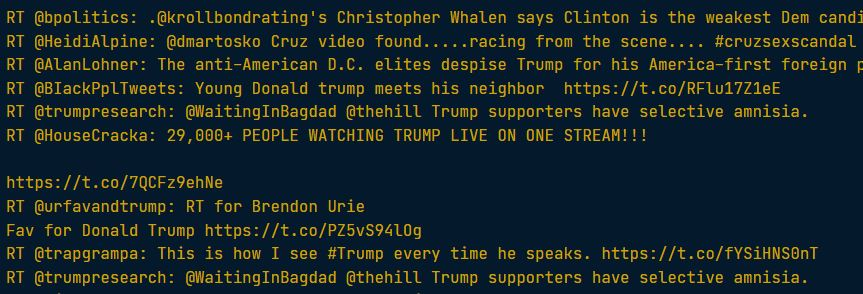

### Exercise 1: using `lambda` function and use `filter()` to select retweets

```python
# Select retweets from the Twitter DataFrame: result
result = filter(lambda x: x[0:2] == 'RT', tweets_df['text'])

# Create list from filter object result: res_list
res_list = list(result)

# Print all retweets in res_list
for tweet in res_list:
    print(tweet)
```

