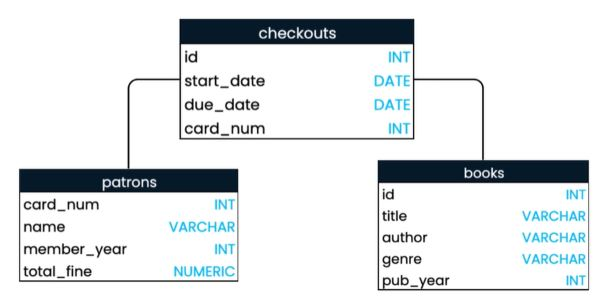
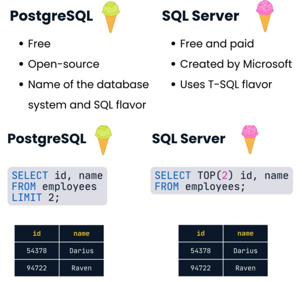

## 🧠 Introduction to SQL

In SQL, all data is stored in the server's hard disk. Servers are powerful computers that store information and perform services via requests made over a network.

---

## 1️⃣ Components of SQL

- 🗃️ **Database** = Table form  
- 📊 **Fields** = Columns  
- 📈 **Records** = Rows

---

## 2️⃣ Field Naming in SQL Format

✅ Best practices:
- Use **lowercase**
- Use **underscores** between words
- Use **singular** nouns
- Ensure uniqueness from table names or other fields

---

## 3️⃣ Common Data Types

In SQL, data types are defined by **schema**.  
📌 Example:
<p align="center">
  
</p>

---

## 🖋️ Introducing Queries

### ✨ Basic SQL Script

```sql
SELECT column1, column2
FROM table_name;
```

### 🔹 Wildcard: Select All Columns

```sql
SELECT * FROM table_name;
```

---

## 📝 Writing Queries

### 1️⃣ `AS` (Aliasing)  
Gives a column a temporary name for readability or presentation.

```sql
SELECT name AS first_name
FROM employees;
```

---

### 2️⃣ `DISTINCT` (Unique Values)  
Filters out duplicate rows from the result set.

```sql
SELECT DISTINCT dept_id, year_hired 
FROM employees;
```

---

### 3️⃣ `CREATE VIEW`  
Creates a virtual table to **save a query** (not actual data).

```sql
CREATE VIEW employee_hire_years AS
SELECT id, name, year_hired
FROM employees;
```

---

## 🍽️ SQL Flavors

Different database systems may use slightly different SQL syntax or features.

<p align="center">
  
</p>
