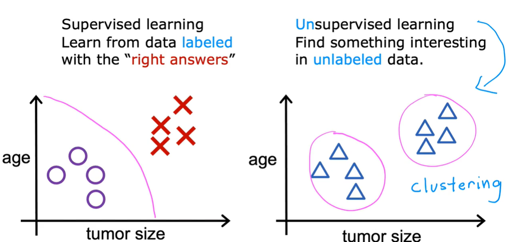
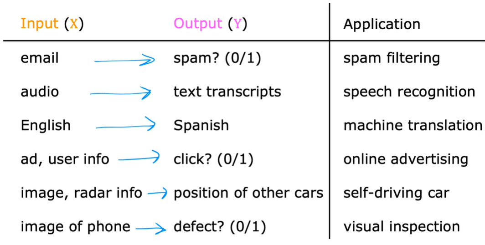
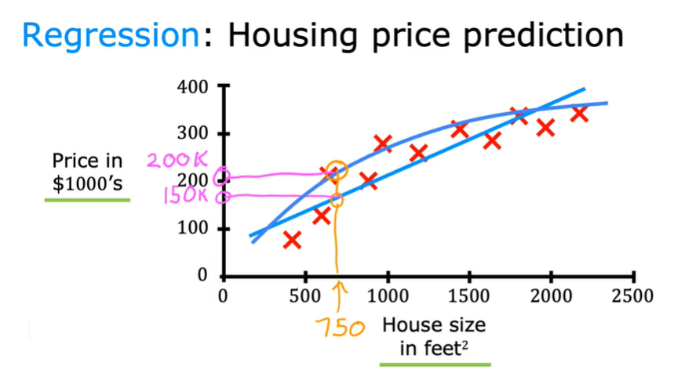
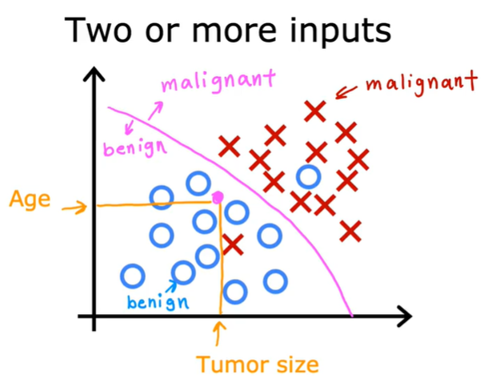

# Supervised Machine Learning: Regression and Classification
> by Andrew Ng

## Supervised vs. Unsupervised Machine Learning

---

## Supervised Machine Learning
Learning from data labeled with the "right answers".

1. **Regression**: Predict a number (infinitely many possible outputs)  
   _Example: Predicting house prices_

   

2. **Classification**: Predict categories (small number of possible outputs)  
   _Example: Email spam detection_

   

---

## Unsupervised Machine Learning
Data only comes with inputs `x`, but not output labels `y`.  
The algorithm has to find structure in the data.

1. **Clustering**: Group similar data points together  
   _Example: Customer segmentation_

   

2. **Anomaly Detection**: Find unusual data points  
   _Example: Fraud detection_

3. **Dimensionality Reduction**: Compress data using fewer numbers  
   _Example: Visualizing high-dimensional data_
