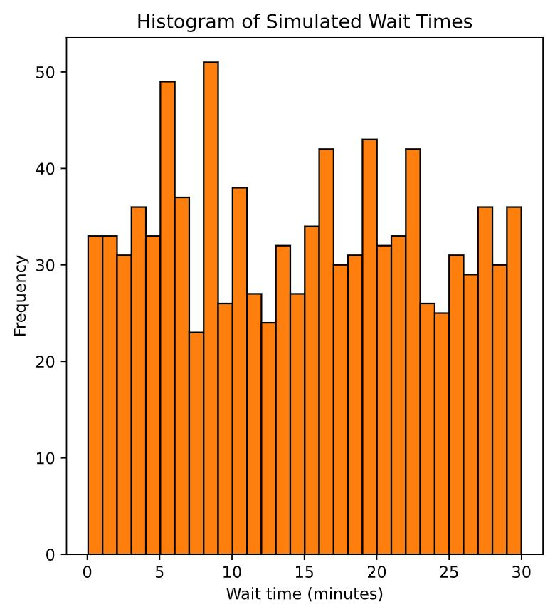

## Exercise 1: Variance and standard deviation

a) Question: Calculate the variance and standard deviation of co2_emission for each food_category with the .groupby() and .agg() methods 

```python
print(food_consumption.groupby('food_category')['co2_emission'].agg(['var','std']))
```

<left>
  
</left>

b) Question: Create a histogram of co2_emission for the beef in food_category and show the plot.

```python
# Create histogram of co2_emission for food_category 'beef'
food_consumption[food_consumption['food_category'] == 'beef']['co2_emission'].hist()

plt.xlabel('CO2 Emissions (kg CO2 per person per year)')
plt.ylabel('Frequency')
plt.title('Distribution of CO2 Emissions for Beef')

plt.show()
```

<left>
  
</left>

c) Question: Create a histogram of co2_emission for the eggs in food_category and show the plot.

```python
plt.figure() #use to start a new plot separate from any previous ones.

food_consumption[food_consumption['food_category'] == 'eggs']['co2_emission'].hist()
plt.show()
```

<left>
  
</left>


📌*Beef has the largest amount of variation in its CO2 emissions, while eggs have a relatively small amount of variation.*

---
## Exercise 2: Data back-ups

The sales software used at your company is set to automatically back itself up, but no one knows exactly what time the back-ups happen. It is known, however, that back-ups happen exactly every 30 minutes. Amir comes back from sales meetings at random times to update the data on the client he just met with. He wants to know how long he'll have to wait for his newly-entered data to get backed up. Use your new knowledge of continuous uniform distributions to model this situation and answer Amir's questions.

```python
# Min and max wait times for back-up that happens every 30 min
min_time = 0
max_time = 30

# Import uniform from scipy.stats
from scipy.stats import uniform

# Calculate probability of waiting 10-20 mins
prob_between_10_and_20 = uniform.cdf(20, 0, 30) - uniform.cdf(10, 0, 30)
print(prob_between_10_and_20)  #output: 0.3333333333333333
```

---

## Exercise 3: Simulating wait times

To give Amir a better idea of how long he'll have to wait, you'll simulate Amir waiting 1000 times and create a histogram to show him what he should expect. Recall from the last exercise that his minimum wait time is 0 minutes and his maximum wait time is 30 minutes.

```python
# Set random seed to 334
np.random.seed(334)

# Import uniform
from scipy.stats import uniform

# Generate 1000 wait times between 0 and 30 mins
wait_times = uniform.rvs(0, 30, size=1000)

# Create a histogram of simulated times and show plot
plt.hist(wait_times, bins=30)
plt.show()
```


📌 *it looks like he'll wait about 15 minutes on average*


