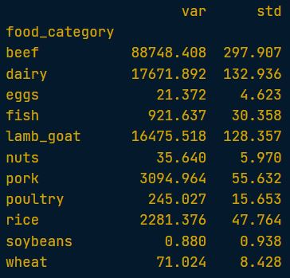
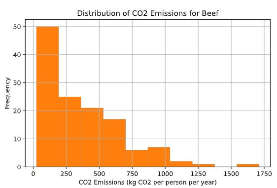
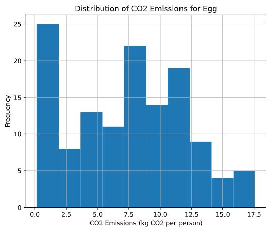

## Exercise 1: Variance and standard deviation

a) Question: Calculate the variance and standard deviation of co2_emission for each food_category with the .groupby() and .agg() methods 

```python
print(food_consumption.groupby('food_category')['co2_emission'].agg(['var','std']))
```

<left>
  
</left>

b) Question: Create a histogram of co2_emission for the beef in food_category and show the plot.

```python
# Create histogram of co2_emission for food_category 'beef'
food_consumption[food_consumption['food_category'] == 'beef']['co2_emission'].hist()

plt.xlabel('CO2 Emissions (kg CO2 per person per year)')
plt.ylabel('Frequency')
plt.title('Distribution of CO2 Emissions for Beef')

plt.show()
```

<left>
  
</left>

c) Question: Create a histogram of co2_emission for the eggs in food_category and show the plot.

```python
plt.figure() #use to start a new plot separate from any previous ones.

food_consumption[food_consumption['food_category'] == 'eggs']['co2_emission'].hist()
plt.show()
```

<left>
  
</left>


📌*Beef has the largest amount of variation in its CO2 emissions, while eggs have a relatively small amount of variation.*

---


