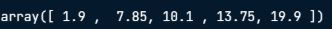
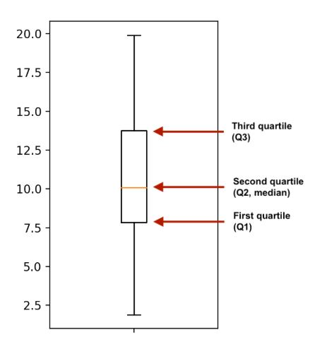

# 🧠 Topic: Introduction to Statistics in Python

## 🎯 Learning Objectives
- [ ] Understand and compute basic summary statistics in Python
- [ ] Use NumPy functions for statistical analysis
- [ ] Apply statistical concepts to analyze datasets
---
### ✅ Concept 1: Summary Statistics

---

### 🔷 1️⃣ Variance

- Measures how spread out the data points are from the **mean**.
- By default, `np.var()` calculates **population variance**.
- Use `ddof=1` to calculate **sample variance** instead.

🧪 **Code Example**
```python
import numpy as np

# Sample variance of 'sleep_total' column
np.var(msleep['sleep_total'], ddof=1)
```
🔎 Note: Without ddof=1, you're computing population variance.

### 🔷 2️⃣ Standard Deviation

#### Option 1: Manually take the square root of the variance
```python
np.sqrt(np.var(msleep['sleep_total'], ddof=1))
```
#### Option 2: Use np.std directly
```python
np.std(msleep['sleep_total'], ddof=1)
```

### 🔷 3️⃣ Mean absolute deviation

```python
dists = msleep['sleep_total'] - np.mean(msleep['sleep_total'])
np.mean(np.abs(dists))
```

Standard deviation vs. mean absolute deviation
> - Standard deviation squares distances, penalizing longer distances more than shorter ones.
> - Mean absolute deviation penalizes each distance equally.
> - One isn't better than the other, but SD is more common than MAD.

### 🔷 4️⃣ Quantiles

```python
np.quantile(msleep['sleep_total'], 0.5)
```
🔎 0.5 quantile = median

### 🔷 5️⃣ Quartiles
```python
np.quantile(msleep['sleep_total'], [0, 0.25, 0.5, 0.75, 1])
```

<left>
  
</left>

📦 Boxplot represent quartiles
```python
import matplotlib.pyplot as plt
plt.boxplot(msleep['sleep_total'])
plt.show()
```
<left>
  
</left>

Quantiles using `np.linspace (start, stop, num)` 

> num = to set how many intervals

```python
np.quantile(msleep['sleep_total'], np.linspace(0, 1, 5))
#output: array([ 1.9, 7.85, 10.1, 13.75, 19.9 ])
```
### 🔷 6️⃣ Interquartile range (IQR)

> Height of the box in a boxplot

```python
np.quantile(msleep ['sleep_total'], 0.75) - np.quantile(msleep ['sleep_total'], 0.25)
#output: 5.9
```

```python
from scipy.stats import iqr
iqr (msleep['sleep_total'])
#output: 5.9
```


---

### ✅ Concept 2: Random Numbers and Probability
-- details

### ✅ Concept 3: More Distributions and the Central Limit Theorem
-- details

### ✅ Concept 4: Correlation and Experimental Design
-- details
