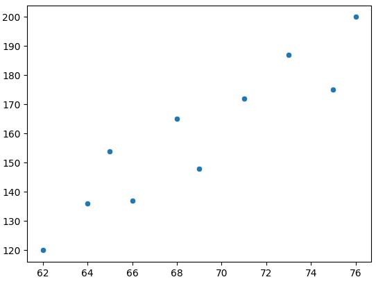
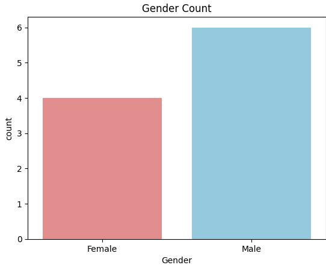
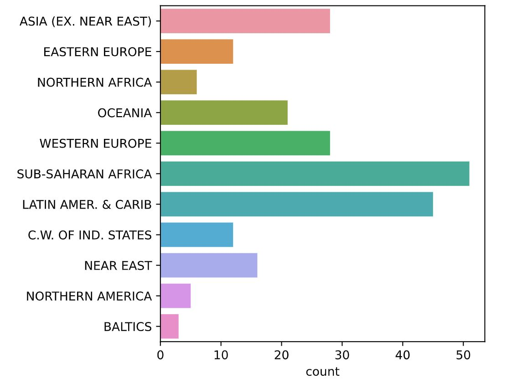
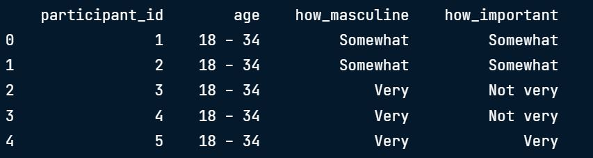
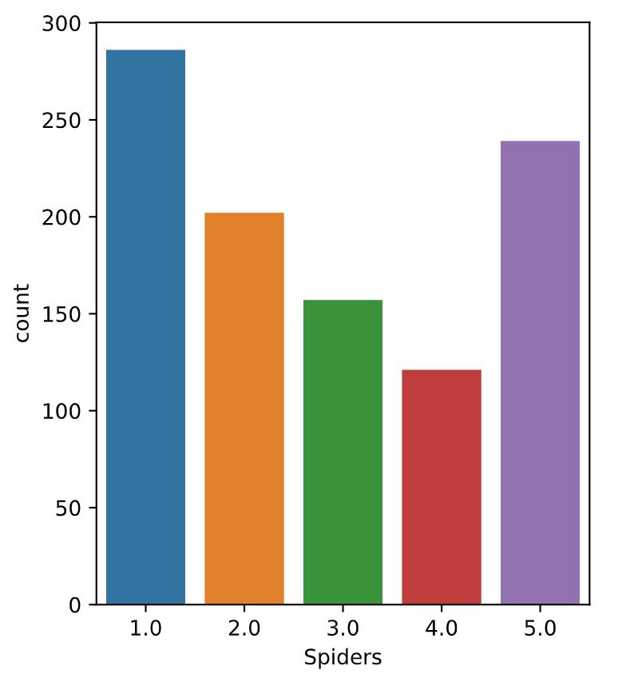
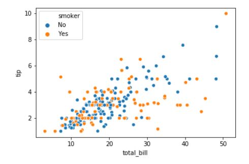
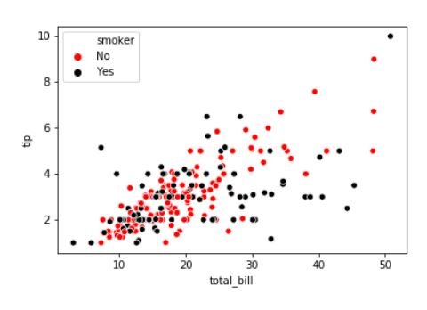
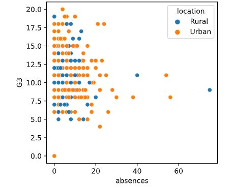
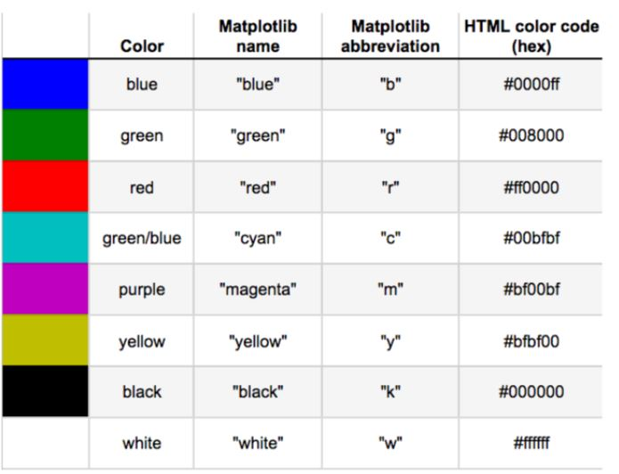

# 🎨 Introduction to Data Visualization with Seaborn

## 🖼️ Why Use Seaborn?

Seaborn is a Python library for statistical data visualization, built on top of Matplotlib.

✅ Easy to use  
✅ Integrates well with Pandas  
✅ Improves plot aesthetics  

---

### 📍 Scatter Plot — Visualizing Relationships
```python
import seaborn as sns
import matplotlib.pyplot as plt
height = [62, 64, 69, 75, 66, 68, 65, 71, 76, 73]
weight = [120, 136, 148, 175, 137, 165, 154, 172, 200, 187]
sns.scatterplot(x=height, y=weight)
plt.show()
```
<left>
  
</left>
📌 This scatter plot shows the relationship between height and weight — as height increases, weight tends to increase too.
---

### 📍 Count Plot — Visualizing Categorical Data

```python
import seaborn as sns
import matplotlib.pyplot as plt
import pandas as pd

gender = ["Female", "Female", "Female", "Female",
          "Male", "Male", "Male", "Male", "Male", "Male"]
df = pd.DataFrame({"Gender": gender})

palette = {"Male": "skyblue", "Female": "lightcoral"}
sns.countplot(data=df, x="Gender", palette=palette)
plt.title("Gender Count")
plt.show()
```

<left>
  
</left>
📌 This count plot visualizes the number of individuals by gender — more males than females in this sample.
---

### 📍 Exercise Example — Count of Countries by Region
```python
import seaborn as sns
import matplotlib.pyplot as plt
sns.countplot(y=region)
plt.show()
```
<left>
  
</left>
📌 Sub-Saharan Africa has the highest number of countries in the dataset.

---

## 🐼 Using Pandas with Seaborn

### What is Pandas?
- Python lib for Data Analysis
- easily read dataset from csv, txt & other type of files
- when reading dataset with pandas, it will create DataFrame objects

### 📍 Read CSV File into DataFrame
```python
import pandas as pd

df = pd.read_csv("masculinity.csv")
df.head()
```
<left>
  
</left>

### 📍 Count Plot from CSV
```python
import pandas as pd
import matplotlib.pyplot as plt
import seaborn as sns

df = pd.read_csv("masculinity.csv")
sns.countplot(x="how_masculine",data=df)
plt.show()
```
<left>
  
</left>
📌 Most people rate dogs as “somewhat masculine”.
---

### 📍 Exercise: Fear of Spiders 
```python
df = pd.read_csv(csv_filepath)
sns.countplot(x="Spiders",data=df)
plt.show()
```
<left>
  
</left>
📌 Most young people in the dataset are not scared of spiders.

---

### 📍 Adding a 3rd variable with `hue`
```python
sns.scatterplot(x="total_bill", y="tip", data=tips, hue="smoker")
plt.show() 
```
<left>
  
</left>
📌 Higher total bills lead to higher tips. Smokers tend to have smaller bills.

---

### 📍 Customizing Hue Colors

```python
hue_colors= {"Yes": "black","No": "red"}
sns.scatterplot(x="total_bill",y="tip",data=tips,hue="smoker", palette=hue_colors)
plt.show()
```
<left>
  
</left>
📌 Customized color palette for smoker groups.

---

### 📍 Exercise: Hue and Scatter plots
```python
# Import Matplotlib and Seaborn
import matplotlib.pyplot as plt
import seaborn as sns

# Change the legend order in the scatter plot
sns.scatterplot(x="absences", y="G3", 
                data=student_data, 
                hue="location",
                hue_order=["Rural","Urban"])

# Show plot
plt.show()
```
<left>
  
</left>
📌 Based on the scatter plot, it shows the students with higher absences tend to have lower grades in both rural and urban areas.

---

### List of matplotlib colors code table
<left>
  
</left>

---

### 🎓 What I Learned Today
- Seaborn simplifies beautiful visualizations.
- Scatter plots show relationships between continuous variables.
- Count plots show frequencies of categorical variables.
- Hue adds a third variable to visualizations.
- Seaborn works great with Pandas for quick insights.


