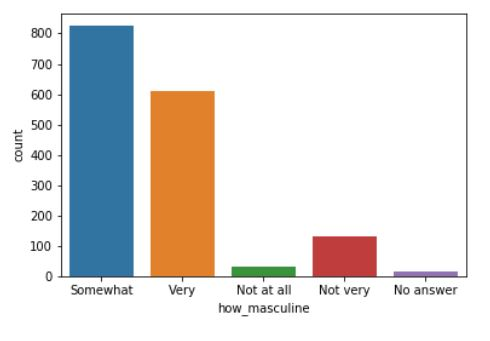

# Introduction to Data Visualization with Seaborn

### 🖼️ Why is Seaborn useful? 

<center>
  
</center>

Advantages of seaborn
- easy to use
- works well with Pandas
- built on top of matplotlib

### 📍 Scatter Plot — Visualizing Relationships
```python
import seaborn as sns
import matplotlib.pyplot as plt
height = [62, 64, 69, 75, 66, 68, 65, 71, 76, 73]
weight = [120, 136, 148, 175, 137, 165, 154, 172, 200, 187]
sns.scatterplot(x=height, y=weight)
plt.show()
```
<left>
  
</left>
- This scatter plot shows the relationship between height and weight — as height increases, weight tends to increase too.

### 📍 Count Plot — Visualizing Categorical Data

```python
import seaborn as sns
import matplotlib.pyplot as plt
import pandas as pd

gender = ["Female", "Female", "Female", "Female",
          "Male", "Male", "Male", "Male", "Male", "Male"]
df = pd.DataFrame({"Gender": gender})

palette = {"Male": "skyblue", "Female": "lightcoral"}
sns.countplot(data=df, x="Gender", palette=palette)
plt.title("Gender Count")
plt.show()
```

<left>
  
</left>
- This count plot shows the number of individuals by gender. It shows that there are more males than females in this dataset.

### 📍 Exercise Example — Count of Countries by Region
```python
# Import Matplotlib and Seaborn
import seaborn as sns
import matplotlib.pyplot as plt

# Create count plot with region on the y-axis
sns.countplot(y=region)

# Show plot
plt.show()
```
<left>
  
</left>
- From the plot, Sub-Saharan Africa has the highest number of countries in the dataset.

---

#### What is Pandas?
- Python lib for Data Analysis
- easily read dataset from csv, txt & other type of files
- when reading dataset with pandas, it will create DataFrame objects

#### 📍 working with DataFrame example (read csv file)
```python
import pandas as pd
df = pd.read_csv("masculinity.csv")
df.head()
```
<left>
  
</left>

#### 📍 Using DataFrame with countplot()
```python
import pandas as pd
import matplotlib.pyplot as plt
import seaborn as sns
df = pd.read_csv("masculinity.csv")
sns.countplot(x="how_masculine",data=df)
plt.show()
```
<left>
  
</left>

---

### 💬 What I Learned Today
- Seaborn makes it easier to create beautiful visualizations.
- Scatter plots are best for showing relationships between two continuous variables.
- Count plots help visualize how common each category is.


