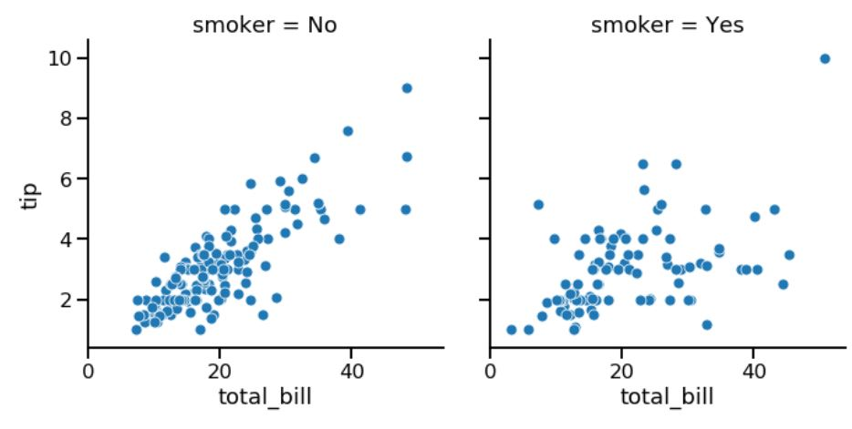
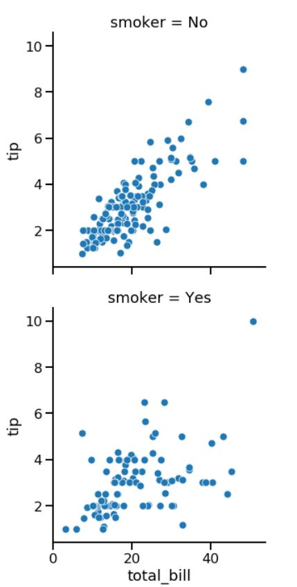
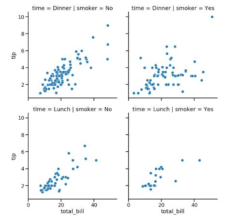
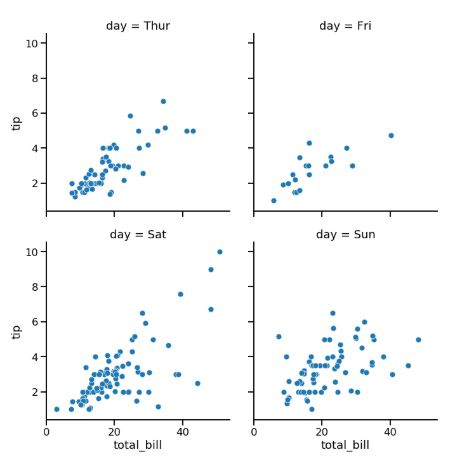
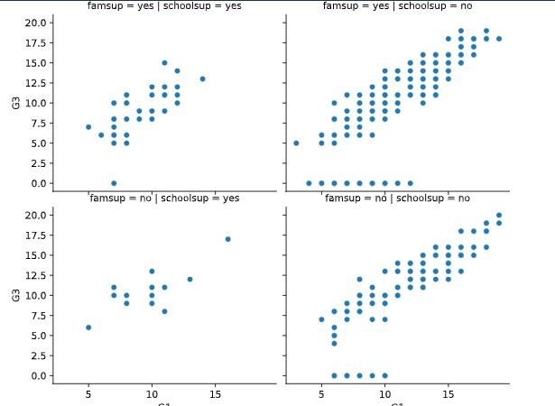
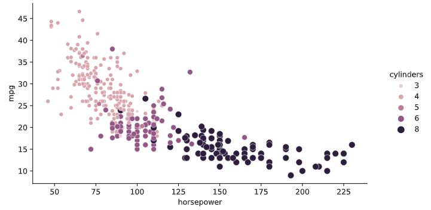
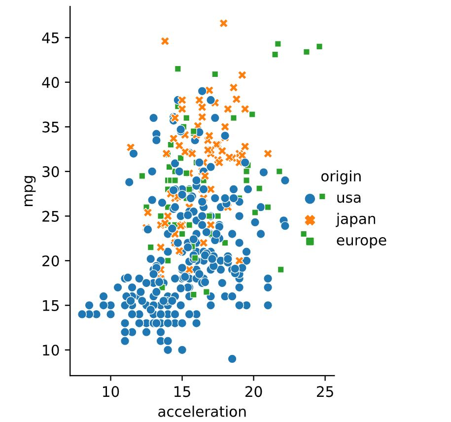
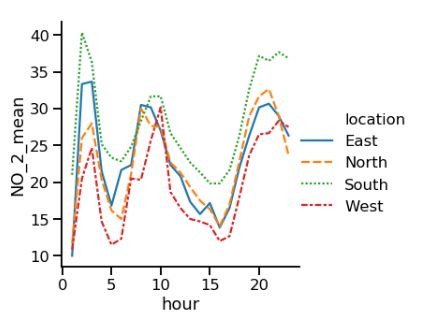
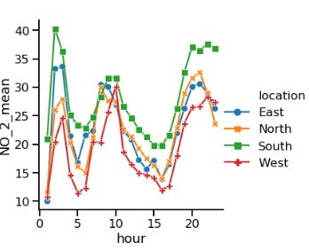

# 📊 Relation Plot & Subplots with Seaborn

## 1. `relplot()` Overview
- A relational plot function that creates either scatter or line plots.
- Supports creation of subplots in a single figure.

---

## 📍 Subplots 1: Column Example

```python
import seaborn as sns
import matplotlib.pyplot as plt

sns.relplot(x="total_bill",
              y="tip",
              data=tips,
              kind="scatter",
              col="smoker")
plt.show()
```
<left>
  
</left>

---

## 📍 Subplots 2: Row Example

```python
sns.relplot(x="total_bill",
              y="tip",
              data=tips,
              kind="scatter",
              row="smoker")
```
<left>
  
</left>

---

## 📍 Subplots 3: Combination of Column and Row

```python
sns.relplot(x = "total_bill",
               y= "tip",
               data = tips,
               kind = "scatter",
               col = "smoker",
               row = "time")
```
<left>
  
</left>

---

## 📍 Subplots 4: Customizing Subplots Layout

```python
sns.relplot(x = "total_bill",
               y= "tip",
               data = tips,
               kind = "scatter",
               col="day",
               col_wrap=2,
               col_order=["Thur", "Fri", "Sat", "Sun"])
```
<left>
  
</left>

---

## 📍 Exercise: Creating Two-Factor Subplots

```python
sns.relplot(x="G1", y="G3", 
            data=student_data,
            kind="scatter", 
            col="schoolsup",
            col_order=["yes", "no"],
            row = "famsup",
            row_order=["yes", "no"])
```
<left>
  
</left>

📌 *The first semester grade does correlate with the final grade, regardless of the support received.*

---

## 2. 🎨 Customizing Scatter Plots (size, hue, style, alpha)
- Enhances visual contrast and analysis

### 📍 Exercise 1: Horsepower vs Fuel Efficiency

```python
import matplotlib.pyplot as plt
import seaborn as sns

sns.relplot(x="horsepower", y="mpg", 
            data=mpg, kind="scatter", 
            size="cylinders",
            hue="cylinders")
plt.show()
```
<left>
  
</left>

📌 *Cars with higher horsepower tend to get lower MPG and often have more cylinders.*

---

### 📍 Exercise 2: Acceleration vs MPG by Country

```python
sns.relplot(x="acceleration", y="mpg", 
            data=mpg, kind="scatter",
            hue="origin",
            style="origin")
```
<left>
  
</left>

📌 *USA cars tend to accelerate faster but get lower MPG compared to Europe and Japan.*

---

## 🔄 Two Types of Relational Plots

### Scatter plots
- Each point is an independent observation

### Line plots
- Each point represents the same object tracked over time

---

### 📍 Example for Line plot

```python
sns.relplot(x="hour",
            y="NO_2_mean",
            data=air_df_loc_mean,
            kind="line",
            style="location",
            hue="location")
```


📌 *South region tends to have slightly higher average Nitrogen Dioxide levels compared to other regions*

---

### 📍 Adjusting line style

```python
markers=True #to display marker for each data point
dashes=False #change line style to exact line
```

<left>
  
</left>


