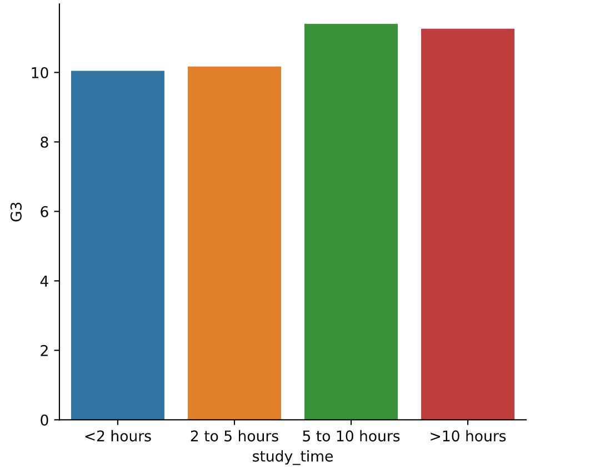
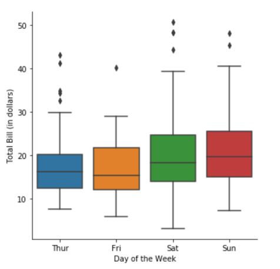
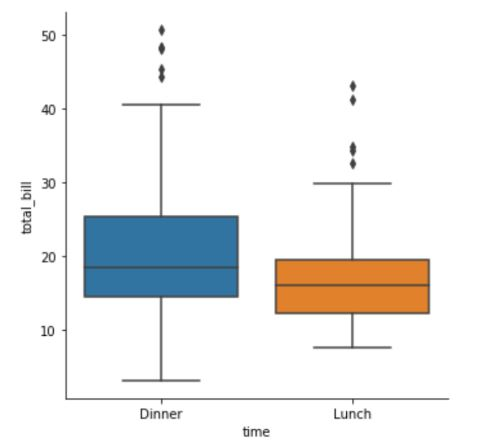
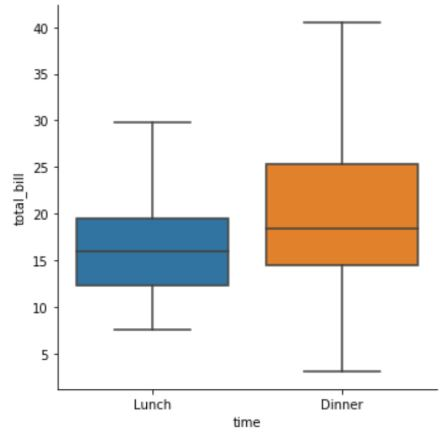
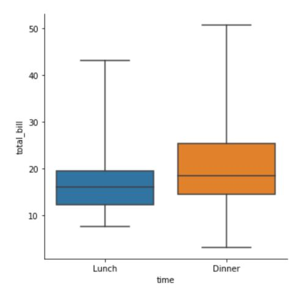
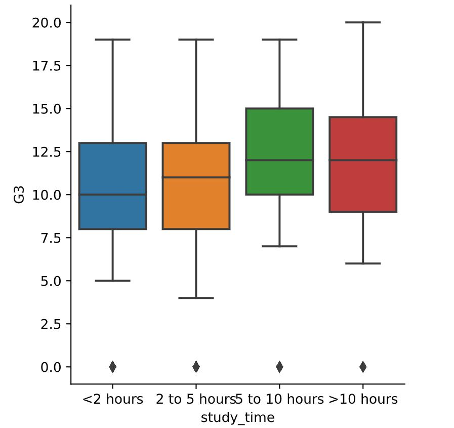

# 🧮 Visualizing Categorical and Quantitative Variable 📊
---

## 🔢 1) Count plots and bar plots
- categorical variable
- eg: count plots, bar plots
- comparisons between groups

### 📍 Count plot using catplot() function

  ```python
  category_order = ["No answer","Not at all","Not very","Somewhat","Very"]

  sns.catplot(x="how_masculine",
              data=masculinity_data,
              kind="count",
              order=category_order)

  plt.show()
  ```
  <left>
    
  </left>

💡 *Based on the order of the masculinity from not masculine to very masculine, we can see that the bar plot shown the majority of the dog masculinity is under category of somewhat masculine type*

---

### 📍 Bar plots using catplot() function
- display the mean of quantitative variable per category

  ```python
  sns.catplot(x="day",
              y="total_bills",
              data = tips,
              kind="bar")
  ```
  <left>
    
  </left>
  
  ### 💡 Key points:
  - *The highest total bill obtained on Sunday whereas the lowest bill is on Friday*
  - *Lines at the centre of each bar showed the confidence intervals for these mean*

  ```python
  #to turn off the auto confidence interval lines,
  #set ci to None
  ci = None
  ```

---

  ### 📍 Exercise: Count plots
  
  ```python
  sns.catplot(y="Internet usage", 
              data=survey_data,
              kind="count",
              col="Age Category")
  ```
  <left>
    
  </left>

  💡 Based on the plots, we can observe that:
  
  - *Most individuals use the internet for a few hours each day, and this trend is consistent across all   age groups.*
  - *However, younger individuals (under 21 years old) tend to spend more time online compared to those aged 21 and above.*

---

  ### 📍 Exercise: Bar plots
  
  ```python
  # Create a bar plot of interest in math, separated by gender
  sns.catplot(x="Gender",
              y="Interested in Math",
              data=survey_data,
              kind="bar")
  ```
  <left>
    
  </left>

  💡 Based on the bar plots, we can observe that:
  
  - *When the y-variable is Boolean (True/False), Seaborn's bar plot displays the proportion of responses that are True.*
  - *In this case, the plot shows that males report a significantly higher interest in math compared to females.*

---

  ### 📍 Exercise: Customizing Bar plots
  
  ```python
  # List of categories from lowest to highest
  category_order = ["<2 hours", "2 to 5 hours", "5 to 10 hours", ">10 hours"]

  # Turn off the confidence intervals
  sns.catplot(x="study_time",
              y="G3",
              data=student_data,
              kind="bar",
              order=category_order,
              ci=None)
  ```
  <left>
    
  </left>

  💡 Based on the bar plots, we can observe that:
  
  - *The bar plot shows that students who reported studying more tend to have slightly higher average final grades.*
  - *However, the relationship between study time and performance is weak, indicating that study time alone may not strongly predict final grades.*

---
---

## 📦 2) Box plots

- Shows the **Distribution** of quantitative data
- See median, spread, skewness, and outliers
- Facilitates comparisons between groups

<div align="left">
  
</div>

💡 Keypoint:

- colored box = represents 25th to 75th percentile
- line in middle of box = median
- whiskers( lines that extend from the ends of the box to show the range of the data, excluding outliers) = spread of distribution
- floating points = outliers

### 📍 Creating a box plots

```python
import matplotlib.pyplot as plt
import seaborn as sns

g = sns.catplot(x="time",
              y="total_bill",
              data=tips,
              kind="box"
              order=["Dinner","Lunch"])

plt.show()
```
<div align="left">
  
</div>

### 📍 Omitting the outliers from box plot
```python
g = sns.catplot(x="time",
              y="total_bill",
              data=tips,
              kind="box"
              sym="") 
```
<div align="left">
  
</div>

### 📍 Changing whiskers using `whis`

```python
#by default, whiskers extend to 1.5 x (IQR)
#IQR = interquartile range (25th to 75th percentile of a distribution of data

#we can set this range as per our query

whis = 2.0 #for example, to extend to 2.0 x (IQR)
whis = [5,95] #to show 5th & 95th percentile
whis = [0,100] #to show min & max values
```
  ### 📍 Example: using `whis` for min & max values

  ```python
  g= sns.catplot(x="time",
                  y="total_bill",
                  data=tips,
                  kind="box",
                  whis=[0, 100])
  ```
  <div align="left">
    
  </div>
  
  💡 *Based on the box plot here, there's no outlier shown. This is because the box & whiskers cover the entire range of data*

---

### 📍 Exercise: Creating & interpret a box plot

```python
# Specify the category ordering
study_time_order = ["<2 hours", 
                    "2 to 5 hours", 
                    "5 to 10 hours", 
                    ">10 hours"]

# Create a box plot and set the order of the categories
sns.catplot(x = "study_time",
            y = "G3",
            data=student_data,
            kind="box",
            order=study_time_order)
```
<div align="left">
  
</div>

---
---

## 🎯 3) Point plots


