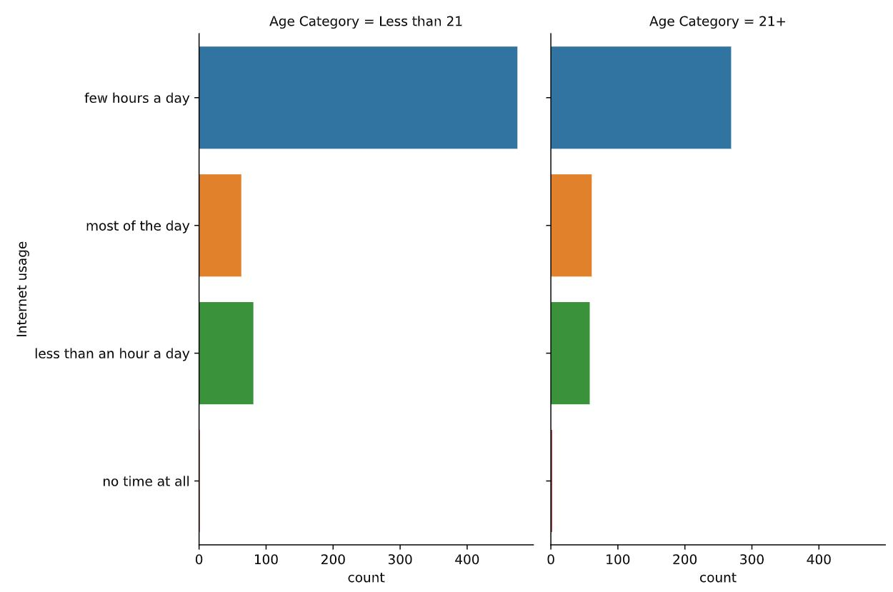

# 🧮 Visualizing Categorical and Quantitative Variable 📊
---

## 🔢 1) Count plots and bar plots
- categorical variable
- eg: count plots, bar plots
- comparisons between groups

### 📍 Count plot using catplot() function
  ```python
  category_order = ["No answer","Not at all","Not very","Somewhat","Very"]

  sns.catplot(x="how_masculine",
              data=masculinity_data,
              kind="count",
              order=category_order)

  plt.show()
  ```
  <left>
    
  </left>

💡 *Based on the order of the masculinity from not masculine to very masculine, we can see that the bar plot shown the majority of the dog masculinity is under category of somewhat masculine type*

---

### 📍 Bar plots using catplot() function
- display the mean of quantitative variable per category

  ```python
  sns.catplot(x="day",
              y="total_bills",
              data = tips,
              kind="bar")
  ```
  <left>
    
  </left>
  
  ### 💡 Key points:
  - *The highest total bill obtained on Sunday whereas the lowest bill is on Friday*
  - *Lines at the centre of each bar showed the confidence intervals for these mean*

  ```python
  #to turn off the auto confidence interval lines,
  #set ci to None
  ci = None
  ```

---

  ### 📍 Exercise: Count plots
  ```python
  sns.catplot(y="Internet usage", 
              data=survey_data,
              kind="count",
              col="Age Category")
  ```
  <left>
    
  </left>

  💡 Based on the plots, we can observe that:
  
  - *Most individuals use the internet for a few hours each day, and this trend is consistent across all   age groups.*
  - *However, younger individuals (under 21 years old) tend to spend more time online compared to those aged 21 and above.*

---

  ### 📍 Exercise: Bar plots
  ```python
  # Create a bar plot of interest in math, separated by gender
  sns.catplot(x="Gender",
              y="Interested in Math",
              data=survey_data,
              kind="bar")
  ```
  <left>
    
  </left>

  💡 Based on the bar plots, we can observe that:
  
  - *When the y-variable is Boolean (True/False), Seaborn's bar plot displays the proportion of responses that are True.*
  - *In this case, the plot shows that males report a significantly higher interest in math compared to females.*


