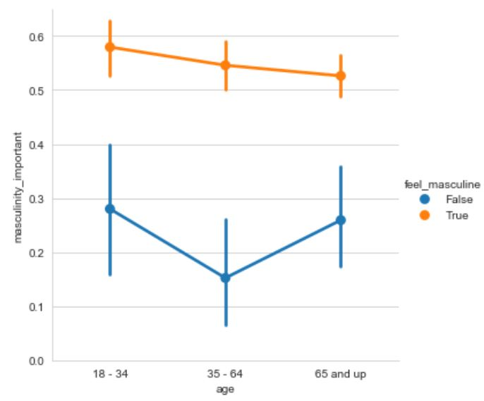

# 🎨🔧Customizing Seaborn Plots

### Why Customize?
- Enhance visual clarity
- Match presentation or publication style
- Emphasize specific patterns or trends

---

## 1️⃣ `sns.set_style()`

Available style presets:
- `"white"`
- `"dark"`
- `"whitegrid"` 
- `"darkgrid"`
- `"ticks"`

---

### 📍 Example: Using `"whitegrid"` Style

```python
sns.set_style("whitegrid")

sns.catplot(x="age",
            y="masculinity_important",
            data=masculinity_data,
            hue="feel masculine",
            kind="point")
```
<left>
  
</left>

📌 This grid style helps viewers accurately interpret data points by making exact values easier to estimate from the gridlines.

---

## 2️⃣ `sns.set_palette()`

- This function is use to change the color of the main elements of plot
- can use it for preset & customnized colors

### Available preset palette:

1) Diverging Palette
> useful for a clear contrast view

- `"RdBu"`
- `"PRGn"`
- `"RdBu_r"` 
- `"PRGn_r"`

2) Sequential Palette
> useful for emphasizing a variable on a continuous scale
   
- `"Greys"`
- `"Blues"`
- `"PuRd"`
- `"GnBu"`

---


