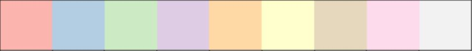
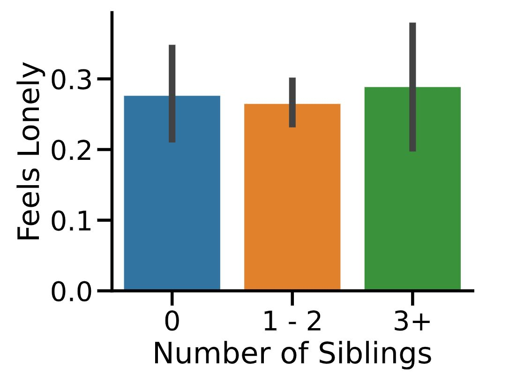

# 🎨🔧Customizing Seaborn Plots

### Why Customize?
- Enhance visual clarity
- Match presentation or publication style
- Emphasize specific patterns or trends

---

## 1️⃣ `sns.set_style()`

Available style presets:
- `"white"`
- `"dark"`
- `"whitegrid"` 
- `"darkgrid"`
- `"ticks"`

---

### 📍 Example: Using `"whitegrid"` Style

```python
sns.set_style("whitegrid")

sns.catplot(x="age",
            y="masculinity_important",
            data=masculinity_data,
            hue="feel masculine",
            kind="point")
```
<left>
  
</left>

📌 This grid style helps viewers accurately interpret data points by making exact values easier to estimate from the gridlines.

---

## 2️⃣ `sns.set_palette()`

- This function is use to change the color of the main elements of plot
- can use it for preset & customnized colors

### Available preset palette:

1) Diverging Palette
> 📌 Best used when you want to highlight deviation or contrast from a central value (e.g., increase vs. decrease)

<div align="center">
  
</div>

Examples:
- `"RdBu"`
- `"PRGn"`
- `"RdBu_r"` 
- `"PRGn_r"`

2) Sequential Palette
> 📌 Best for showing ordered data or continuous scale (e.g., low → high)

<div align="center">
  
</div>

Examples:
- `"Greys"`
- `"Blues"`
- `"PuRd"`
- `"GnBu"`

3) Custom palette
> 📌 Simple custom palette using color names

<div align="center">
  
</div>

Examples:
- `"red"`
- `"green"`
- `"orange"`
- `"blue"`
- `"yellow"`
- `"purple"`

4) Hex custom palette
> 📌 For full control over color styling

<div align="center">
  
</div>

```python
custom_palette = ['#FBB4AE', '#B3CDE3', '#CCEBC5',
             '#DECBE4', '#FED9A6', '#FFFFCC',
             '#E5D8BD', '#FDDAEC', '#F2F2F2']

sns.set_palette(custom_palette)
```

---

## 3️⃣ `sns.set_context()`
> 📌used to scale up or down the visual elements in a plot.
> It's especially useful for adapting plots for different display environments—whether you're showing it in a paper, on a slide, or during a talk.

Available style presets: (from smallest to largest scale)

| Context      | Use Case                                                   |
| ------------ | ---------------------------------------------------------- |
| `"paper"`    | For printed publications (compact visuals)                 |
| `"notebook"` | Default; ideal for Jupyter Notebooks                       |
| `"talk"`     | Slightly larger for presentations                          |
| `"poster"`   | Very large—perfect for conference posters or large screens |

---

### 📍 Exercise: Changing the scale using context function
```python
sns.set_context("poster")
```
<left>
  
</left>

🔑 Keypoints:
- *This will make all plot elements much larger and easier to see in a large display, like a poster presentation..*

---

## 4️⃣ 🏷️ Add Title & Labels

> - Creative informative visualizations
> - `FacetGrid` vs `AxesSubplot` objects

| **Object Type** | **Plot Types**                     | **Characteristics**               |
|------------------|------------------------------------|------------------------------------|
| `FacetGrid`      | `relplot()`, `catplot()`           | Can create subplots                |
| `AxesSubplot`    | `scatterplot()`, `countplot()`, etc. | Only creates a single plot         |
 


```python
g = sns.catplot(x="Region",
            y="Birthrate",
            data=gdp_data,
            kind="box")

g.fig.suptitle("New Title", y=1.03) #y here represents the height of the title from figure plot
```
 


