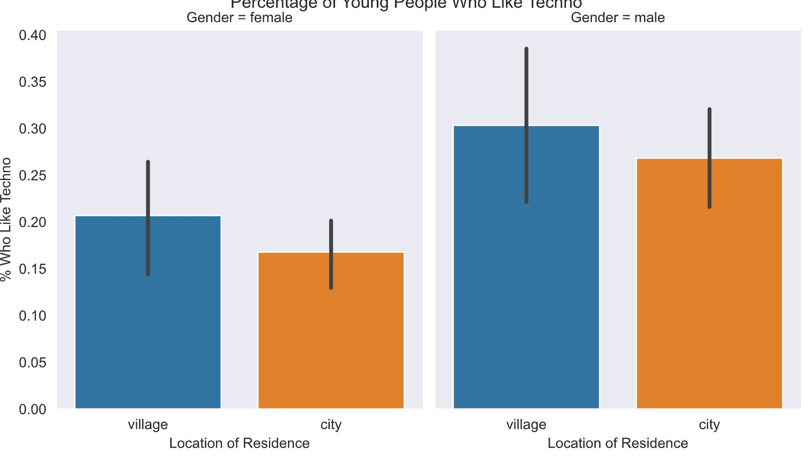

# SEABORN EXERCISES

### 1️⃣ 🎨📦 Exercise 1: Customizing with a Color Palette
> - We want to understand the age distribution between male and female survey respondents by using a box plot. We'll also apply a custom color palette to make the plot more visually appealing.

```python
# Set the background style
sns.set_style("darkgrid")

# Use a custom color palette for gender
custom_palette = ["#39A7D0","#36ADA4"]
sns.set_palette(custom_palette)

# Create a box plot to compare age by gender
sns.catplot(x="Gender", y="Age", 
            data=survey_data, kind="box")

# Display the plot
plt.show()
```
<left>
  
</left>

🔑 Based om the plots:
- The median age is similar for both genders.
- However, females tend to be younger, with their ages more concentrated in the lower range compared to males.
- This gives us a basic snapshot of the age and gender breakdown in the survey responses.


---

### 2️⃣ 🎨📦 Exercise 2: Box plot with subgroups

> Analyze the young people survey dataset to explore if the age distribution differs between those who:

- Are interested in having pets ("Yes")

- Are not interested ("No")

✅ This exercise helps reinforce your understanding of box plots, subgroups, and plot customization.

```python
# Set palette to "Blues"
sns.set_palette("Blues")

# Adjust to add subgroups based on "Interested in Pets"
g = sns.catplot(x="Gender",
                y="Age", data=survey_data, 
                kind="box", hue="Interested in Pets")

# Set title to "Age of Those Interested in Pets vs. Not"
g.fig.suptitle("Age of Those Interested in Pets vs. Not")

# Show plot
plt.show()
```
<left>
  
</left>

🔑 Based on the plots:
*After controlling for gender, the age distributions of those interested in pets and those not interested appear to be very similar. The presence of subgroups by hue helps us better understand potential patterns within each gender.*

---

### 3️⃣ Exercise 3: Box plot with subgroups & subplots

> Explore the young people survey dataset to see if the proportion of people who like techno music differs based on gender & living area

```python
# Set the figure style to "dark"
sns.set_style("dark")

# Adjust to add subplots per gender
g = sns.catplot(x="Village - town", y="Likes Techno", 
                data=survey_data, kind="bar",
                col = "Gender")

# Add title and axis labels
g.fig.suptitle("Percentage of Young People Who Like Techno", y=1.02)
g.set(xlabel="Location of Residence", 
       ylabel="% Who Like Techno")

# Show plot
plt.show()
```
<left>
  
</left>

🔑 Based on the two plots:
*In summary, Males like techno more than females overall. Village residents (both genders) tend to like techno more than city residents.*


