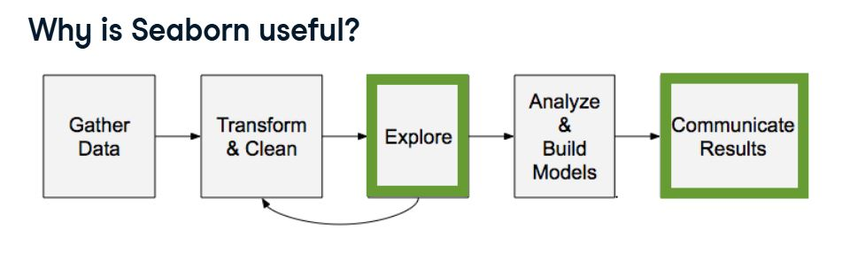
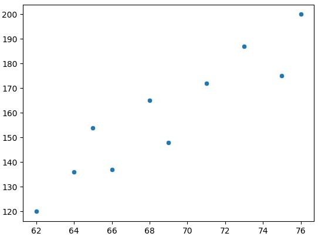

# Introduction to Data Visualization with Seaborn

### 🖼️ Why is Seaborn useful?

<center>
  
</center>

Advantages of seaborn
- easy to use
- works well with Pandas
- built on top of matplotlib

```python
import seaborn as sns
import matplotlib.pyplot as plt
height = [62, 64, 69, 75, 66, 68, 65, 71, 76, 73]
weight = [120, 136, 148, 175, 137, 165, 154, 172, 200, 187]
sns.scatterplot(x=height, y=weight)
plt.show()
```
<left>
  
</left>
